# **基于Vue.js和网易云音乐API的Web音乐播放器**

##### 移动端在线查看地址：[http://9z0pvw.coding-pages.com](http://9z0pvw.coding-pages.com/)

##### PC端在线查看地址：[http://mlnz0x.coding-pages.com](http://mlnz0x.coding-pages.com/)

**目录**

[第一章 准备 1](#_Toc29511)

>   [一、 项目描述 1](#_Toc9404)

>   [1． 此项目为web音乐播放器App（SPA） 1](#_Toc6524)

>   [2． 包括以下子模块 1](#_Toc30866)

>   [3． 音乐APP系统的开发模式（前后端分离） 2](#_Toc22849)

>   [二、 技术选型 2](#_Toc23439)

>   [1． 前端项目技术栈 2](#_Toc19716)

>   [2． 后端项目技术栈 3](#_Toc7989)

>   [三、 前端路由 3](#_Toc17893)

>   [1． PC端路由 3](#_Toc1855)

>   [2． 移动端路由 3](#_Toc15198)

>   [四、 后端API接口 4](#_Toc11561)

>   [1． 发现音乐接口文档 4](#_Toc2374)

>   [2． 推荐歌单 接口文档 4](#_Toc3239)

>   [3． 最新音乐 接口文档 6](#_Toc30411)

>   [4． 最新MV页面 接口文档 7](#_Toc26936)

>   [5． 最新MV页面 接口文档 8](#_Toc5718)

>   [6． 歌单详情页 接口文档 8](#_Toc31996)

>   [7． MV详情页 接口文档 10](#_Toc19833)

>   [8． 更多API接口请参考 11](#_Toc9066)

>   [五、 项目功能界面 12](#_Toc3407)

>   [1． PC端 12](#_Toc1701)

>   [2． PAD、PHONE、移动端 19](#_Toc18180)

>   [六、 能学到的知识 23](#_Toc19577)

>   [1． 流程及开发方法 23](#_Toc17746)

>   [2． Vue插件或第三方库 23](#_Toc26700)

>   [3． 样式、布局、效果相关 23](#_Toc6972)

[第二章 应用开发详解 24](#_Toc8581)

>   [一、 前端项目初始化步骤 24](#_Toc6478)

>   [二、 后台项目的环境安装配置 24](#_Toc6709)

>   [三、 项目结构分析 24](#_Toc1577)

>   [四、 资源准备 25](#_Toc16393)

>   [1． 相关概念 25](#_Toc31780)

>   [五、 Vue全家桶 - 前端工程化 25](#_Toc8654)

>   [1． 模块化相关规范 25](#_Toc7500)

>   [2． 浏览器端模块化规范 26](#_Toc13838)

>   [3． 服务器端模块化规范 26](#_Toc6153)

>   [4． 大一统的模块化规范 - ES6模块化 26](#_Toc17288)

>   [5． Node.js中通过babel体验ES6模块化 27](#_Toc2600)

>   [6． ES6模块化的基本语法 28](#_Toc25246)

>   [六、 Webpack 30](#_Toc32043)

>   [1． 当前Web开发面临的困境 30](#_Toc1766)

>   [2． Webpack概述 30](#_Toc19969)

>   [3． Webpack的基本应用 31](#_Toc14972)

>   [4． webpack 中的加载器 33](#_Toc9111)

>   [5． webpack 中加载器的基本使用 34](#_Toc16595)

>   [七、 ESLint 37](#_Toc29412)

>   [1． 理解 37](#_Toc17682)

>   [2． 自定义错误和提示 37](#_Toc17498)

>   [3． 相关配置文件 38](#_Toc19943)

>   [八、 Vue单文件组件 38](#_Toc26027)

>   [1． 传统组件的问题和解决方案 38](#_Toc19942)

>   [2． Vue 单文件组件的基本用法 38](#_Toc14543)

>   [3． webpack 中配置 vue 组件的加载器 39](#_Toc14002)

>   [4． 在 webpack 项目中使用 vue 40](#_Toc17634)

>   [5． webpack 打包发布 41](#_Toc30648)

>   [九、 Vue 脚手架的基本用法 41](#_Toc10291)

>   [1． Vue 脚手架生成的项目结构分析 41](#_Toc22590)

>   [2． Vue 脚手架的自定义配置 42](#_Toc28250)

>   [十、 iconfont 字体图标 42](#_Toc14648)

>   [1． iconfont 介绍 42](#_Toc28984)

>   [2． iconfont 使用 43](#_Toc32477)

>   [十一、 LESS 45](#_Toc30384)

>   [1． 当前主流的三种 css 预编译器 45](#_Toc10209)

>   [2． 安装LESS 45](#_Toc6529)

>   [3． 编写样式 45](#_Toc1915)

>   [十二、 Vue-Router 45](#_Toc15790)

>   [1． 路由的基本概念与原理 45](#_Toc161)

>   [2． 前端路由 46](#_Toc5455)

>   [3． Vue Router 46](#_Toc21539)

>   [4． Vue-Router路由重定向 48](#_Toc8386)

>   [5． Vue-Router嵌套路由用法 48](#_Toc24707)

>   [6． Vue-Router动态路由匹配 50](#_Toc11671)

>   [7． 路由组件传递参数 51](#_Toc27077)

>   [8． Vue-Router命名路由 52](#_Toc12718)

>   [9． Vue-Router编程式导航 53](#_Toc28811)

>   [十三、 前后台交互ajax 54](#_Toc3160)

>   [1． 下载依赖包 54](#_Toc6966)

>   [2． 请求方法 55](#_Toc17792)

>   [3． 案例 55](#_Toc2273)

>   [十四、 Element-UI 的基本使用 56](#_Toc25387)

>   [1． 基于命令行方式手动安装 56](#_Toc25976)

>   [2． 基于图形化界面自动安装 56](#_Toc28613)

>   [十五、 Vuex 57](#_Toc3891)

>   [1． 组件之间共享数据的方式 57](#_Toc24604)

>   [2． Vuex是什么 57](#_Toc24892)

>   [3． 什么样的数据适合存储到Vuex中 57](#_Toc15866)

>   [4． Vuex的基本使用 57](#_Toc25784)

>   [5． Vuex核心概念 58](#_Toc28069)

>   [6． State 58](#_Toc18243)

>   [7． Mutation 59](#_Toc29993)

>   [8． Action 62](#_Toc13159)

>   [9． Getter 64](#_Toc30799)

>   [十六、 代码测试与打包发布项目 65](#_Toc25696)

>   [1． 编码测试 65](#_Toc709)

>   [2． 打包发布 65](#_Toc1680)

[第三章 Vue全家桶-项目优化上线 66](#_Toc9180)

>   [一、 项目优化 66](#_Toc30163)

>   [1． 生成打包报告 66](#_Toc18571)

>   [2． 通过 vue.config.js 修改 webpack 的默认配置 66](#_Toc25597)

>   [3． 为开发模式与发布模式指定不同的打包入口 67](#_Toc20103)

>   [4． configureWebpack 和 chainWebpack 67](#_Toc22394)

>   [5． 通过 chainWebpack 自定义打包入口 67](#_Toc6704)

>   [6． 通过 externals 加载外部 CDN 资源 68](#_Toc4135)

>   [7． 通过 CDN 优化 ElementUI 的打包 69](#_Toc6122)

>   [8． 首页内容定制 69](#_Toc6107)

>   [9． 路由懒加载 70](#_Toc5577)

>   [二、 项目上线 71](#_Toc6251)

>   [1． 项目上线相关配置 71](#_Toc31285)

>   [2． 通过 node 创建 web 服务器 71](#_Toc15097)

>   [3． 开启 gzip 配置 72](#_Toc7347)

>   [4． 配置 HTTPS 服务 73](#_Toc18464)

>   [5． 配置 HTTPS 服务 73](#_Toc24059)

>   [6． 使用 pm2 管理应用 73](#_Toc30257)

>   [7． 使用GITHUB托管代码 74](#_Toc31145)

>   [8． 使用CODING.NET托管代码并且产生静态网站 75](#_Toc16039)

[第四章 总结 79](#_Toc9837)

# 准备

## 项目描述

### 此项目为web音乐播放器App（SPA）

根据不同的应用场景，音乐APP一般都提供了 PC 端、移动 APP、移动
Web、微信小程序等多种终端访问方式

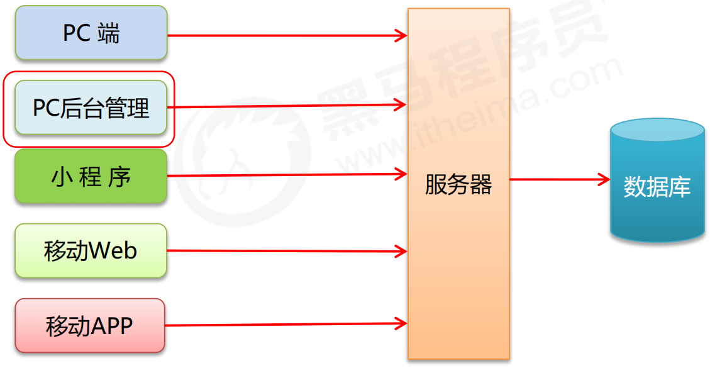

### 包括以下子模块

1.  歌曲/歌单/MV的搜索，并分页显示搜索结果

    1.  歌曲/歌单/MV的播放功能

        1.  歌曲/歌单/MV的显示功能

            1.  歌曲/歌单/MV分页评论显示功能

                1.  歌曲歌词滚动

                2.  发现音乐、推荐歌单、最新音乐、最新MV的显示

                3.  自适应PC端和手机端的功能

### 音乐APP系统的开发模式（前后端分离）

音乐APP系统整体采用前后端分离的开发模式，其中前端项目是基于 Vue 技术栈的 SPA
项目

## 技术选型

1.  使用Vue全家桶 + ElementUI + VANT + ES6 + Webpack + Axios等前端最新最热的技术

2.  采用模块化、组件化、工程化的模式开发

### 前端项目技术栈

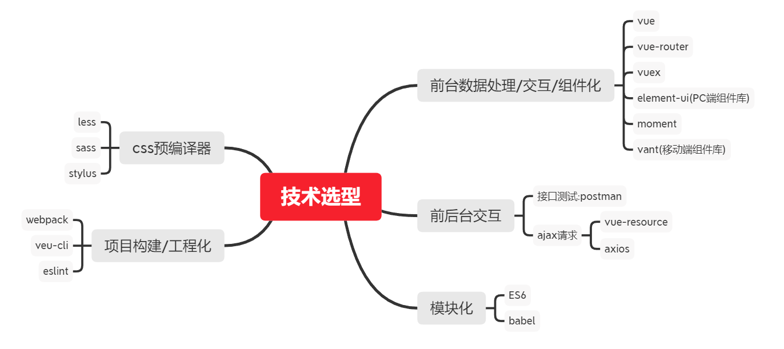

### 后端项目技术栈

-   Node.js

-   Express

-   MySQL

## 前端路由

### PC端路由

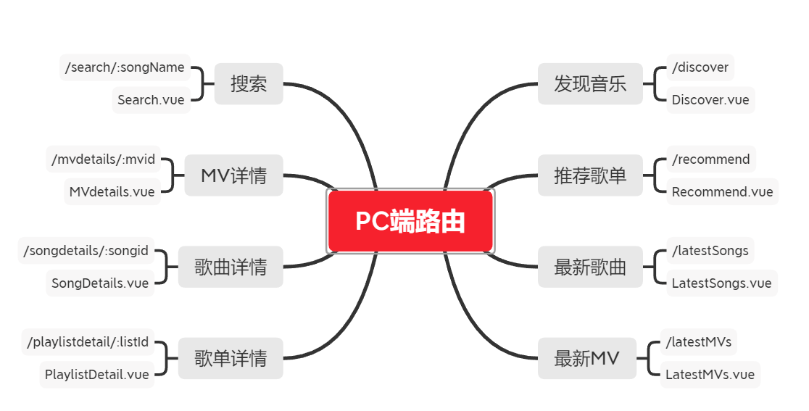

### 移动端路由

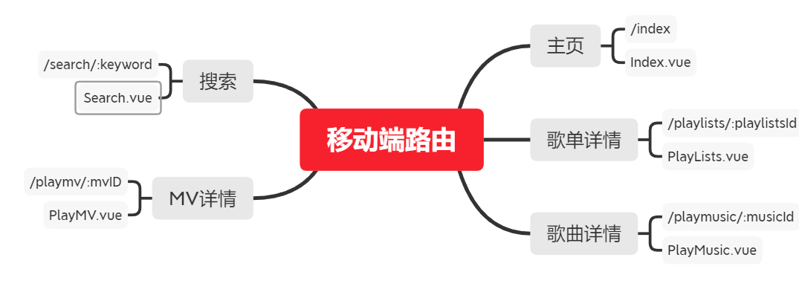

## 后端API接口

-   所有接口的请求方式都是get

### 发现音乐接口文档

#### 轮播图

-   说明 : 调用此接口 , 可获取 banner( 轮播图 ) 数据

-   可选参数 :

1.  type:资源类型,对应以下类型,默认为 0 即PC

0: pc  
1: android  
2: iphone  
3: ipad

-   接口地址：https://autumnfish.cn/banner

### 推荐歌单 接口文档

#### 歌单列表 - 精品歌单

-   说明 : 调用此接口 , 可获取精品歌单

-   可选参数 :

1.  limit: 取出歌单数量 , 默认为 20

2.  cat: 歌单的标签，可选值如下

全部  
欧美  
华语  
流行  
说唱  
摇滚  
民谣  
电子  
轻音乐  
影视原声  
ACG  
怀旧  
治愈  
旅行

-   接口地址 : <https://autumnfish.cn/top/playlist/highquality>

#### 歌单列表 - 歌单列表

-   说明 : 调用此接口 , 可获取网友精选碟歌单

-   可选参数 :

1.  limit:获取的个数

2.  offset: 偏移数量,用于分页,如:(页数 -1)\*20, 其中 20 为 limit 的值

3.  cat: 歌单的标签, 可选值如下

全部  
欧美  
华语  
流行  
说唱  
摇滚  
民谣  
电子  
轻音乐  
影视原声  
ACG  
怀旧  
治愈  
旅行

-   接口地址 : <https://autumnfish.cn/top/playlist/>

### 最新音乐 接口文档

#### 最新音乐

-   说明 : 调用此接口 , 可获取最新音乐

-   必选参数 :

1.  type: 地区类型 id,对应以下:

全部:0  
华语:7  
欧美:96  
日本:8  
韩国:16

-   接口地址 : <https://autumnfish.cn/top/song>

#### 播放歌曲

-   说明 : 调用此接口 , 传入音乐 id, 可获得歌曲播放地址

-   参数 : id: 音乐 id, 如 id=347230

-   接口地址 : <https://autumnfish.cn/song/url>

### 最新MV页面 接口文档

#### 全部MV

-   说明 : 调用此接口 , 可获取全部 mv

-   可选参数 :

1.  area: 地区,可选值为：全部、内地、港台、欧美、日本、韩国、不填则为全部

2.  type: 类型,可选值为：全部、官方版、原生、现场版、网易出品,不填则为全部

3.  order: 排序,可选值为：上升最快、最热、最新、不填则为上升最快

4.  limit: 取出数量 , 默认为 30

5.  offset: 偏移数量,用于分页,如 :( 页数 -1)\*50,其中 50 为 limit 的值,默认为 0

-   接口地址 : <https://autumnfish.cn/mv/all>

### 最新MV页面 接口文档

#### 搜索接口

-   根据关键字搜索结果，通过调整类型，搜索不同的值

-   必选参数 : keywords : 关键词

-   可选参数 :

-   limit : 返回数量 , 默认为 30

-   offset : 偏移数量，用于分页 , 如 : 如 :( 页数 -1)\*30, 其中 30 为 limit 的值
    , 默认为 0

-   type: 搜索类型；默认为 1 即单曲 , 取值意义 :如下

歌曲:1  
歌单:1000  
MV:1004

-   接口地址 : <https://autumnfish.cn/search>

### 歌单详情页 接口文档

#### 歌单信息

-   必选参数 : id : 歌单 id

-   接口地址 : <https://autumnfish.cn/playlist/detail>

#### 热门评论

-   说明 : 调用此接口 , 传入 type, 资源 id 可获得对应资源热门评论(不需要登录)

-   必选参数 :

1.  id : 资源 id

2.  tpye: 数字 , 资源类型 , 对应歌曲 , mv, 专辑 , 歌单 , 电台, 视频对应以下类型

0: 歌曲  
1: mv  
2: 歌单  
3: 专辑  
4: 电台  
5: 视频

-   可选参数 :

1.  limit: 取出评论数量 , 默认为 20

2.  offset: 偏移数量 , 用于分页 , 如 :( 评论页数 -1)\*20, 其中 20 为 limit 的值

-   接口地址 : <https://autumnfish.cn/comment/hot>

#### 最新评论

-   说明 : 调用此接口 , 传入音乐 id 和 limit 参数 , 可获得该歌单的最新评论

-   必选参数 : id: 歌单 id

-   可选参数 :

1.  limit: 取出评论数量 , 默认为 20

2.  offset: 偏移数量 , 用于分页 , 如 :( 评论页数 -1)\*20, 其中 20 为 limit 的值

-   接口地址 : <https://autumnfish.cn/comment/playlist>

### MV详情页 接口文档

####  MV地址

-   通过这个接口可以获取MV的在线地址

-   必选参数 : id: mv的id

-   接口地址 : <https://autumnfish.cn/mv/url>

#### 相关MV

-   说明 : 调用此接口 , 传入 mvid 可获取相似 mv

-   必选参数 : mvid: mv的id

-   接口地址 : <https://autumnfish.cn/simi/mv>

#### MV信息

-   说明 : 调用此接口 , 传入 mvid ,即可获取MV信息

-   必选参数 : mvid: mv 的 id

-   接口地址 : <https://autumnfish.cn/mv/detail>

#### 歌手信息

-   说明 : 调用此接口 , 传入歌手 id, 可获得歌手部分信息,比如歌手的头像

-   必选参数 : id: 歌手 id, 可由搜索接口获得

-   接口地址 : <https://autumnfish.cn/artists>

#### MV评论

-   说明 : 调用此接口 , 传入mv id 和 limit 参数,可获得该 mv 的所有评论

-   必选参数 : id: mv id

-   可选参数 :

1.  limit: 取出评论数量 , 默认为 20

2.  offset: 偏移数量 , 用于分页 , 如 :( 评论页数 -1)\*20, 其中 20 为 limit 的值

-   接口地址 : <https://autumnfish.cn/comment/mv>

### 更多API接口请参考

-   https://binaryify.github.io/NeteaseCloudMusicApi

## 项目功能界面

### PC端

#### 发现音乐页面

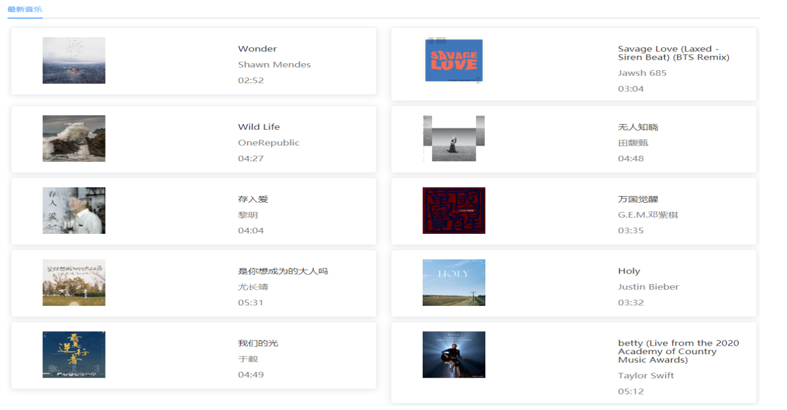

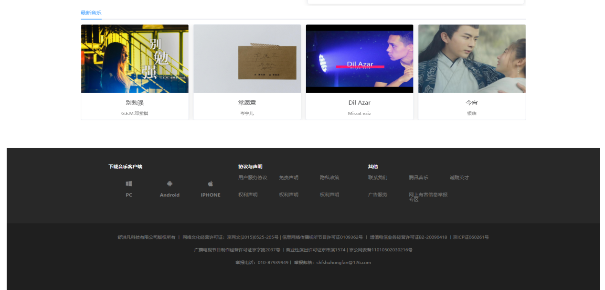

#### 推荐歌单页面 

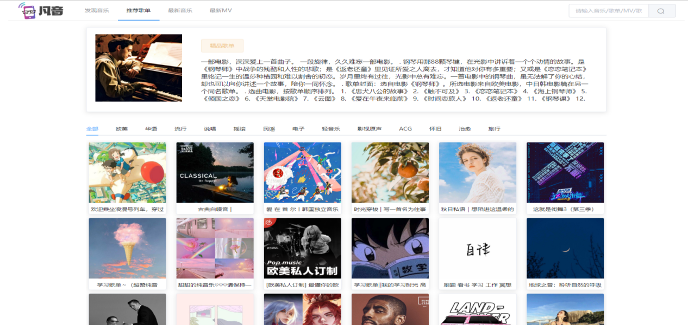

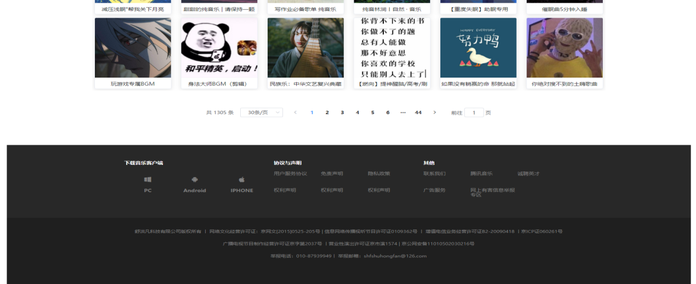

#### 最新音乐页面

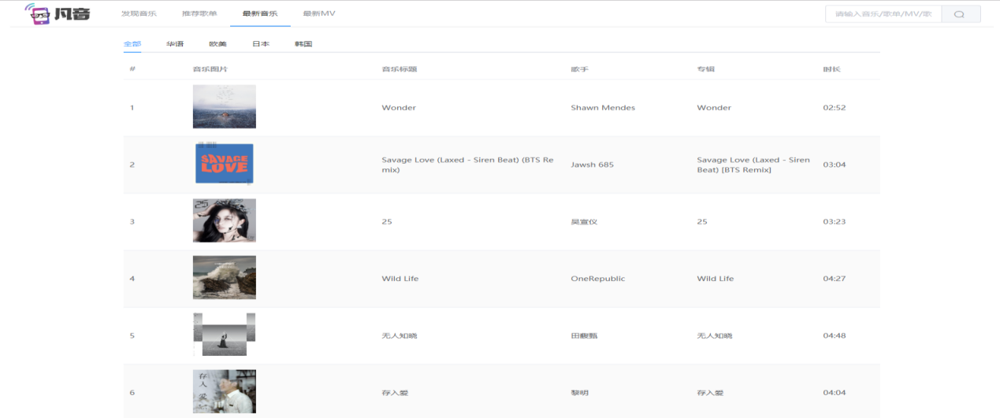

#### 最新MV页面

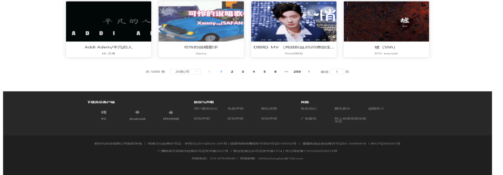

#### 歌单详情页

#### 歌单评论页

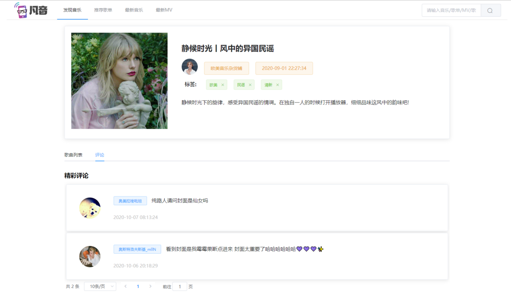

#### 歌曲详情页/评论页

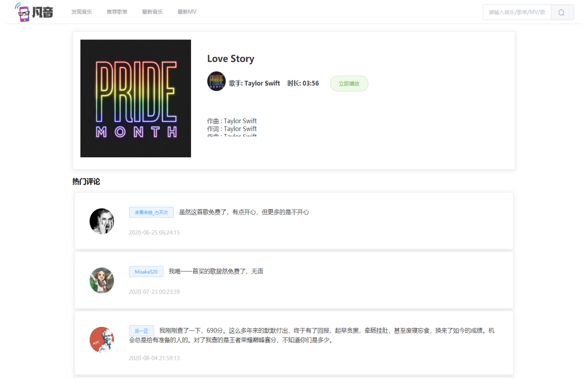

#### 歌曲播放器

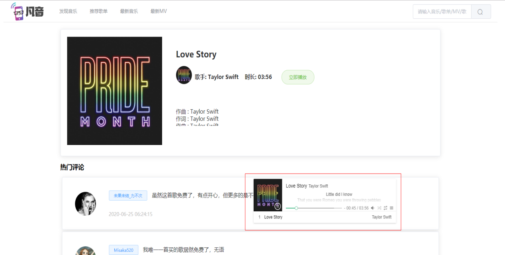

#### MV播放页面/详情页/相关推荐/分页评论

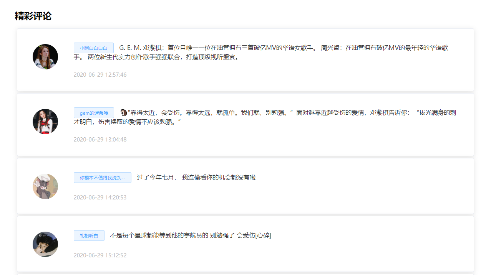

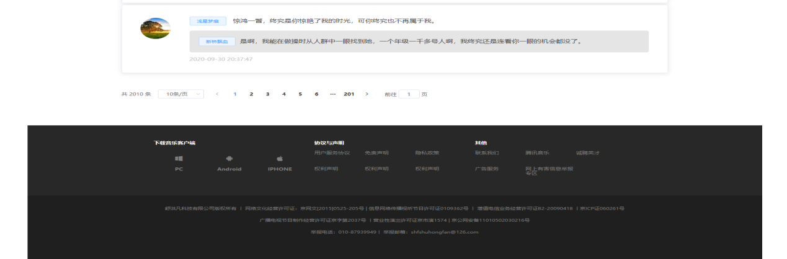

#### 歌曲/歌单/MV搜索页面

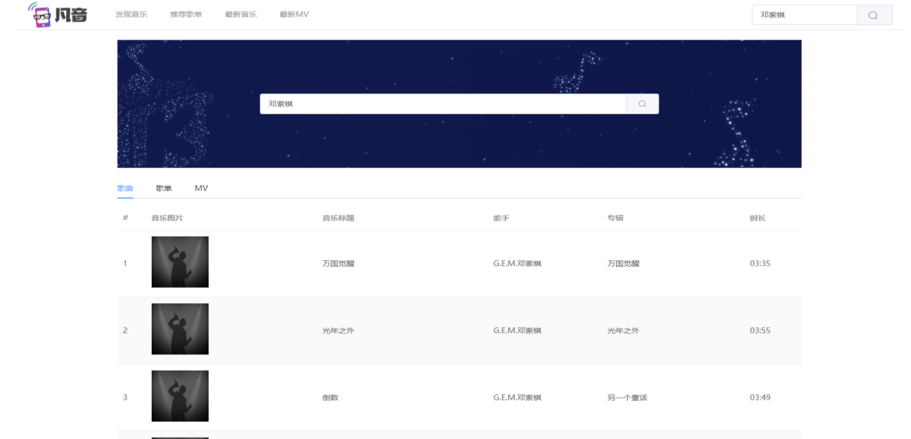

### PAD、PHONE、移动端

#### 发现音乐页

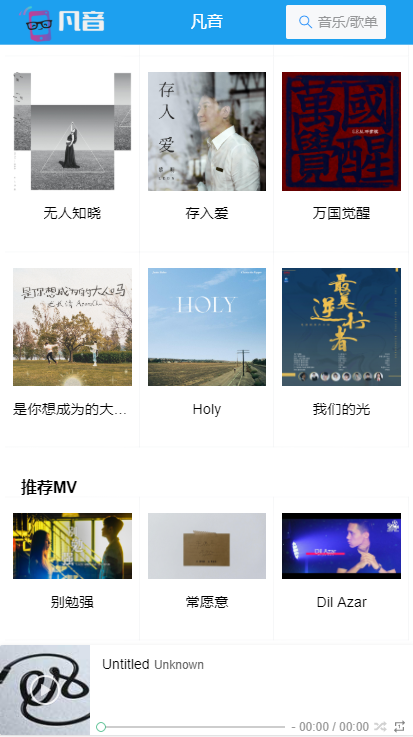

#### 推荐歌单页

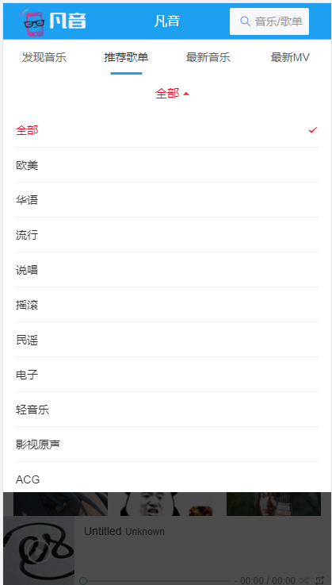

#### 最新音乐页

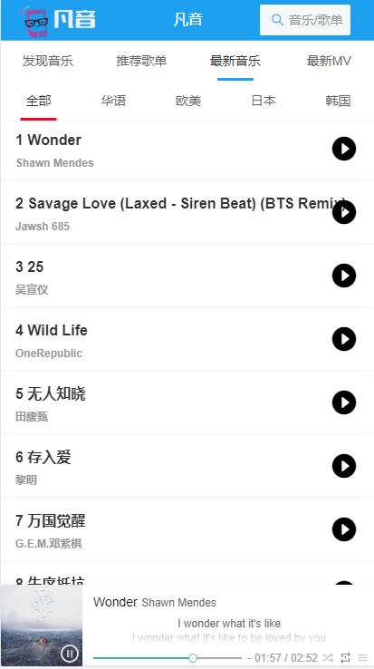

#### 歌曲播放页、详情页

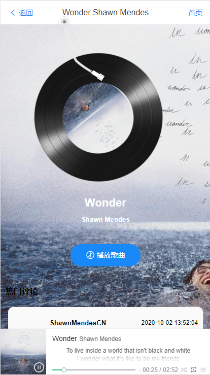

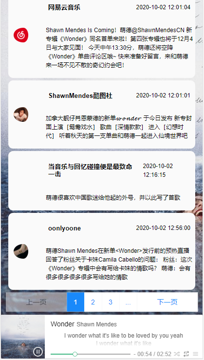

#### 最新MV页

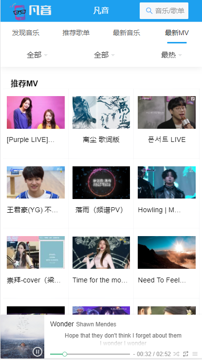

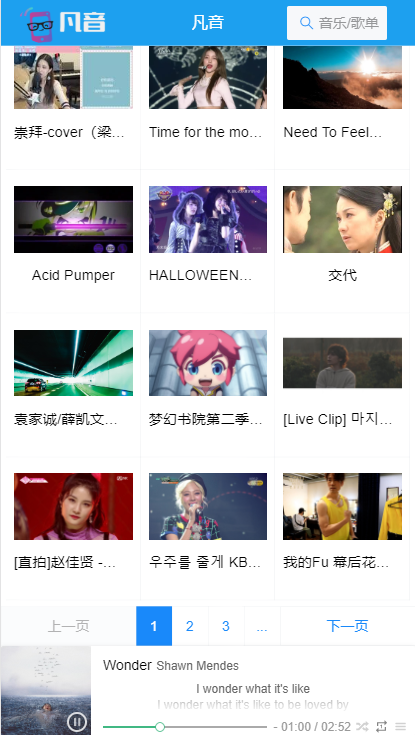

#### 歌单详情页、评论页

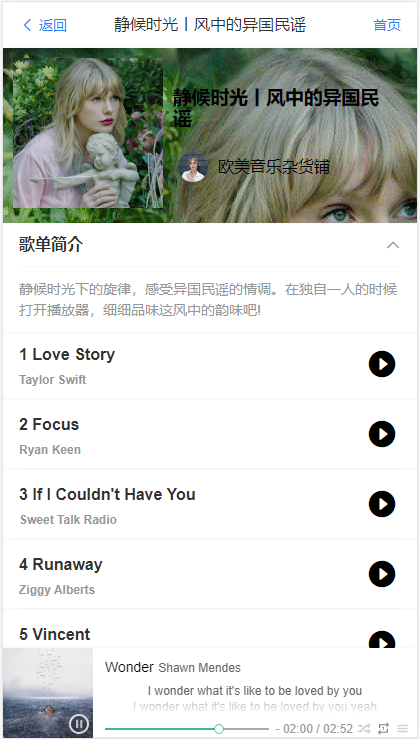

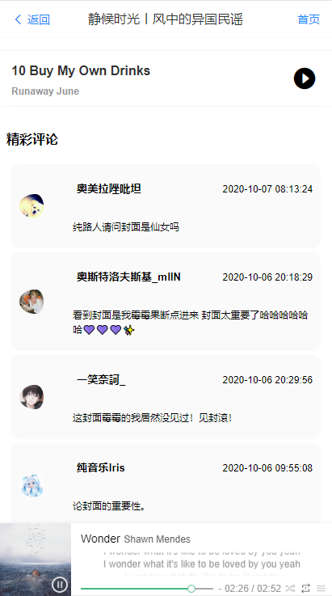

#### MV详情页、MV评论页

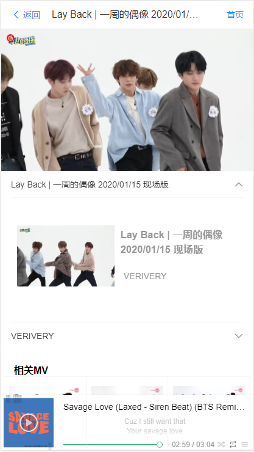

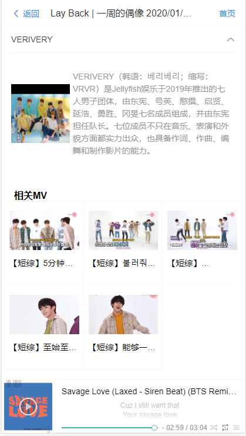

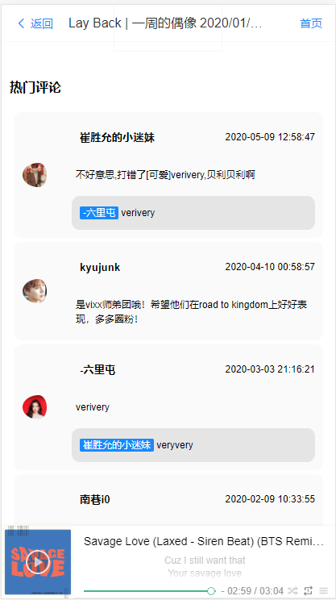

#### 歌曲/歌单/MV搜索页面

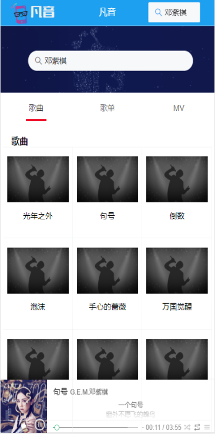

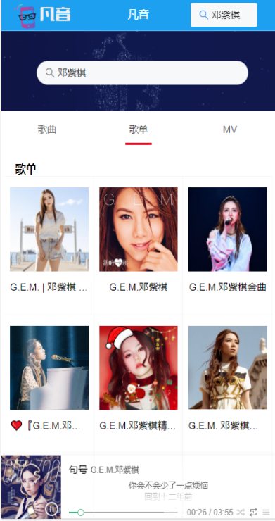

## 能学到的知识

### 流程及开发方法

-   熟悉一个项目的开发流程

-   学会组件化、模块化、工程化的开发模式

-   掌握使用vue-cli手脚架初始化Vue.js项目

-   学会使用AXIOS接收数据，实现前后端分离开发

-   学会ES6 + ESLINT 的开发方式

-   掌握一些项目的优化技巧

### Vue插件或第三方库

-   学会使用vue-router开发单页应用

-   学会使用axios/vue-resource与后端进行数据交互

-   学会使用vuex管理应用组件状态

-   学会使用better-scroll实现页面滑动效果

-   学会使用 ElementUI / VANT 组件库构建界面

### 样式、布局、效果相关

-   学会使用less/sass/stylus编写模块化的CSS

-   学会使用Vue.js的过渡编写炫酷的交互动画

-   学会制作并使用图标字体

-   学会移动端经典的css sticky footer 布局

-   学会flex弹性布局

# 应用开发详解

## 前端项目初始化步骤

1.  安装 Vue 脚手架

2.  通过 Vue 脚手架创建项目

3.  配置 Vue 路由

4.  配置 Element-UI 组件库

5.  配置 axios 库

6.  初始化 git 远程仓库

7.  将本地项目托管到 Github 或 码云 中

## 后台项目的环境安装配置

1.  安装 MySQL 数据库

2.  安装 Node.js 环境

3.  安装NeteaseCloudMusicApi 网易云后台API接口

4.  下载地址:https://github.com/Binaryify/NeteaseCloudMusicApi

5.  配置项目相关信息

6.  启动项目

7.  使用 Postman 测试后台项目接口是否正常

## 项目结构分析

## 资源准备

### 相关概念

1.  标注图(设计稿): 对应用界面各个组成元素进行坐标/大小/颜色等进行标签的界面图

2.  切图: 将应用界面的一些静态图形部分, 通过工具(如 photoshop)剪裁生成的图片

3.  图片 Base64: 样式中引用的小图片, 在 webpack 打包会自动处理转换为样式内部的
    Base64 编码字符串

4.  2x 与 3x 图: 不同手机的屏幕密度不一样, 一般都在 2 以上(如 iphone6 为
    2,iphone6s 为 3), 为了适配不同的手机, UI 设计师为同一个图片制作了 2x 和 3x
    的 2 套图片(图形一样, 但大小不一样)

## Vue全家桶 - 前端工程化

### 模块化相关规范

#### 传统开发模式的主要问题

-   命名冲突

-   文件依赖

#### 通过模块化可以解决上述问题

-   模块化就是把单独的一个功能模块封装到一个模块(文件)中,模块之间相互隔离,但是可以通过特定的接口公开内部成员,也可以依赖别的模块

-   模块化开发的好处:方便代码的重用,从而提高开发效率,并且方便后期的维护

### 浏览器端模块化规范

-   AMD: Require.js (http://www.requirejs.cn/)

-   CMD : Sea.js (https://seajs.github.io/seajs/docs/)

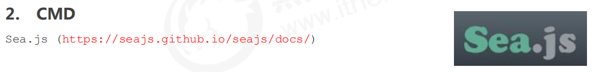

### 服务器端模块化规范

-   CommonJs

1.  模块化分为单文件模块与包

2.  模块成员导出:module.exports和exports

3.  模块成员导入:require(‘模块标识符’)

### 大一统的模块化规范 - ES6模块化

-   在ES6模块化诞生之前,JavaScript社区已经尝试并提出了AMD,CMD,CommonJS等模块化规范

-   但是,这些社区提出的模块化标准,还是存在一定的差异性与局限性,并不是把浏览器与服务器通用的模块化标准,例如

1.  AMD和CMD适用于服务器端的JavaScript模块化

2.  CommonJS适用于服务器端的JavaScript模块化

-   因此,ES6语法规范中,在语言层面上定义了ES6模块化规范,是浏览器与服务端通用的模块化开发规范

#### ES6模块化规范中定义

-   每个js文件都是一个独立的模块

-   导入模块成员使用import关键字

-   暴露模块成员使用export关键字

### Node.js中通过babel体验ES6模块化

1.  npm install --save-dev \@babel/core \@babel/cli \@babel/preset-env
    \@babel/node

2.  npm install --save \@babel/polyfill

3.  项目跟目录创建文件 babel.config.js

4.  babel.config.js 文件内容如右侧代码

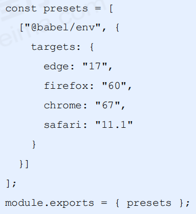

1.  通过 npx babel-node index.js 执行代码

### ES6模块化的基本语法

#### 默认导出与默认导入

1.  默认导出语法export default 默认导出的成员

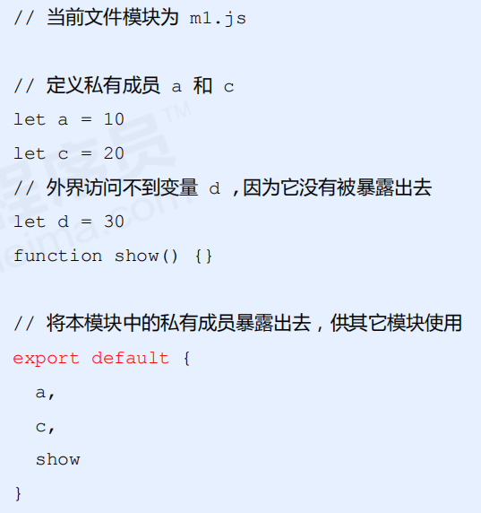

1.  默认导入语法 import 接收名称 from ‘模块标识符’

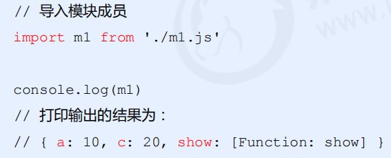

-   注意: 每个模块中,只允许使用一次export default,否则会报错!!!

#### 按需导出与按需导入

1.  按需导出语法 export let s1 = 10

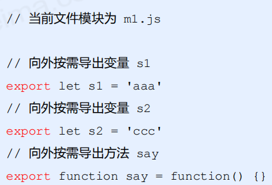

1.  按需导入语法 import { s1 } from ‘模块标识符’

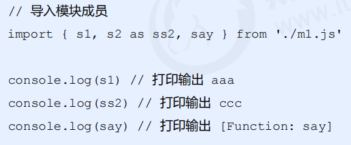

-   注意: 每个模块中,可以使用多次按需导出

#### 直接导入并执行模块代码

-   有时候,我们只想单纯执行某个模块中的代码,并不需要得到模块中向外暴露的成员,此时,可以直接导入并执行模块代码

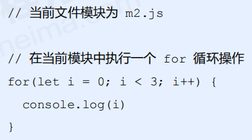

## Webpack

### 当前Web开发面临的困境

-   文件依赖关系错综复杂

-   静态资源请求效率低

-   模块化支持不太友好

-   浏览器对高级JavaScript特性兼容度特别低

-   ...

### Webpack概述

1.  webpack 是一个流行的前端项目构建工具（打包工具），可以解决当前 web
    开发中所面临的困境。

2.  webpack 提供了友好的模块化支持，以及代码压缩混淆、处理 js
    兼容问题、性能优化等强大的功能，从而让程序员把

3.  工作的重心放到具体的功能实现上，提高了开发效率和项目的可维护性。

4.  目前绝大多数企业中的前端项目，都是基于 webpack 进行打包构建的

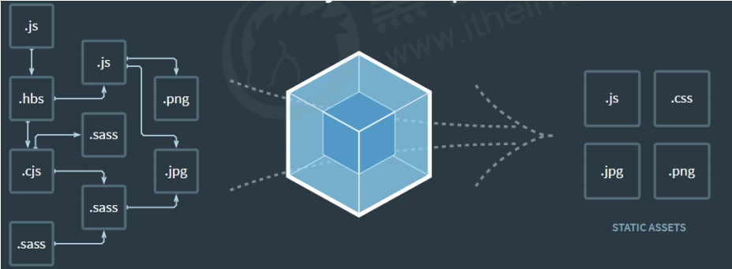

### Webpack的基本应用

#### 在项目中安装和配置 webpack

1.  运行 npm install webpack webpack-cli –D 命令，安装 webpack 相关的包

2.  在项目根目录中，创建名为 webpack.config.js 的 webpack 配置文件

3.  在 webpack 的配置文件中，初始化如下基本配置：

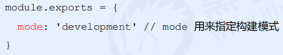

1.  在 package.json 配置文件中的 scripts 节点下，新增 dev 脚本如下：

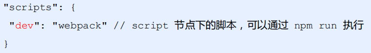

1.  在终端中运行 npm run dev 命令，启动 webpack 进行项目打包。

#### 配置打包的入口与出口

-   webpack 的 4.x 版本中默认约定：

1.  打包的入口文件为 src -\> index.js

2.  打包的输出文件为 dist -\> main.js

如果要修改打包的入口与出口，可以在 webpack.config.js 中新增如下配置信息：

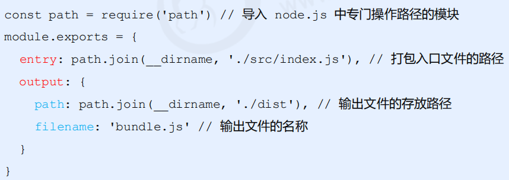

#### 配置 webpack 的自动打包功能

1.  运行 npm install webpack-dev-server –D 命令，安装支持项目自动打包的工具

2.  修改 package.json -\> scripts 中的 dev 命令如下：

    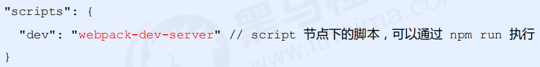

3.  将 src -\> index.html 中，script 脚本的引用路径，修改为 "/buldle.js”

4.  运行 npm run dev 命令，重新进行打包

5.  在浏览器中访问 http://localhost:8080 地址，查看自动打包效

-   注意:

1.  webpack-dev-server 会启动一个实时打包的 http 服务器

2.  webpack-dev-server
    打包生成的输出文件，默认放到了项目根目录中，而且是虚拟的、看不见的

#### 配置 html-webpack-plugin 生成预览页面

1.  运行 npm install html-webpack-plugin –D 命令，安装生成预览页面的插件

2.  修改 webpack.config.js 文件头部区域，添加如下配置信息：

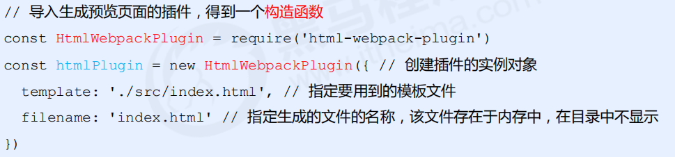

1.  修改 webpack.config.js 文件中向外暴露的配置对象，新增如下配置节点：

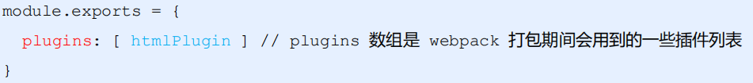

#### 配置自动打包相关的参数

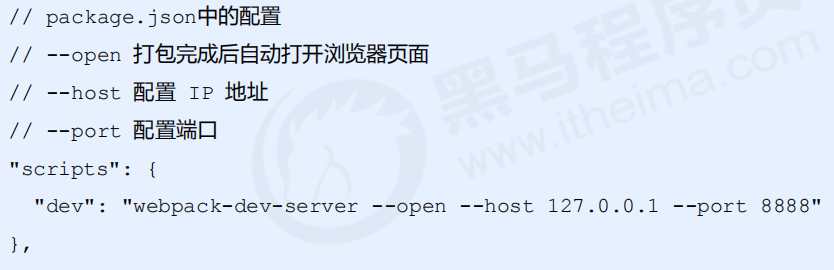

### webpack 中的加载器

#### 通过 loader 打包非 js 模块

-   在实际开发过程中，webpack 默认只能打包处理以 .js 后缀名结尾的模块，其他非
    .js 后缀名结尾的模块，webpack 默认处理不了，需要调用 loader
    加载器才可以正常打包，否则会报错！

1.  loader 加载器可以协助 webpack 打包处理特定的文件模块，比如：

2.  less-loader 可以打包处理 .less 相关的文件

3.  sass-loader 可以打包处理 .scss 相关的文件

4.  url-loader 可以打包处理 css 中与 url 路径相关的文件

#### loader 的调用过程

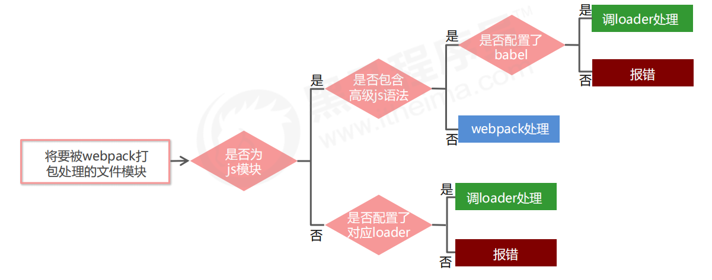

### webpack 中加载器的基本使用

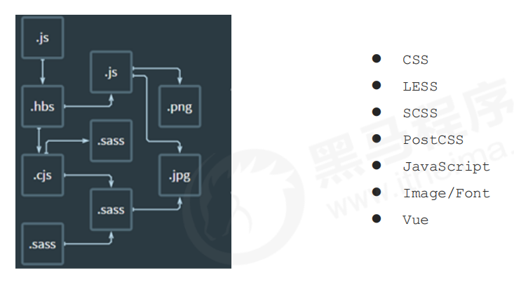

#### 打包处理 css 文件

1.  运行 npm i style-loader css-loader -D 命令，安装处理 css 文件的 loader

2.  在 webpack.config.js 的 module -\> rules 数组中，添加 loader 规则如下：

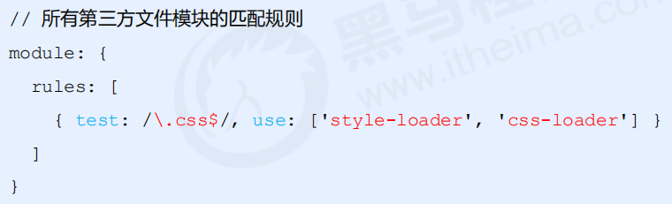

-   其中，test 表示匹配的文件类型， use 表示对应要调用的 loader

-   注意:

1.  use 数组中指定的 loader 顺序是固定的

2.  多个 loader 的调用顺序是：从后往前调用

#### 打包处理 less 文件

1.  运行 npm i less-loader less -D 命令

2.  在 webpack.config.js 的 module -\> rules 数组中，添加 loader 规则如下：

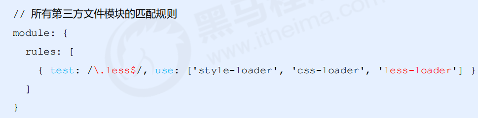

#### 打包处理 scss 文件

1.  运行 npm i sass-loader node-sass -D 命令

2.  在 webpack.config.js 的 module -\> rules 数组中，添加 loader 规则如下：

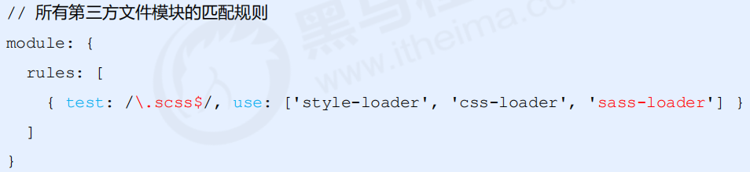

#### 配置 postCSS 自动添加 css 的兼容前缀

1.  运行 npm i postcss-loader autoprefixer -D 命令

2.  在项目根目录中创建 postcss 的配置文件 postcss.config.js，并初始化如下配置：

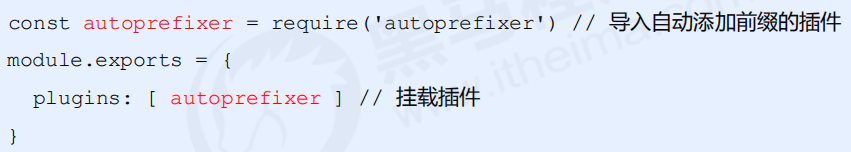

1.  在 webpack.config.js 的 module -\> rules 数组中，修改 css 的 loader
    规则如下：

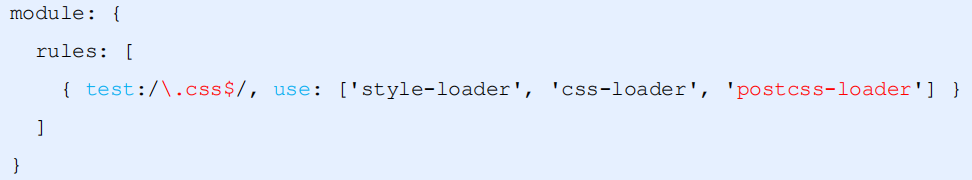

#### 打包样式表中的图片和字体文件

1.  运行 npm i url-loader file-loader -D 命令

2.  在 webpack.config.js 的 module -\> rules 数组中，添加 loader 规则如下：

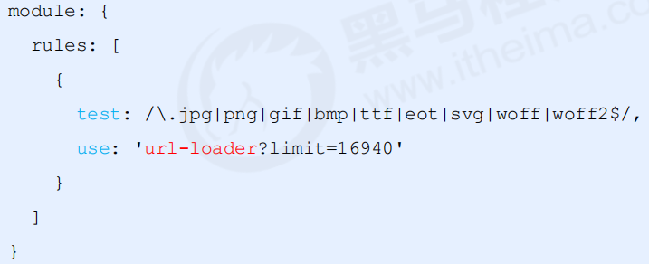

-   其中 ? 之后的是 loader 的参数项;limit
    用来指定图片的大小，单位是字节(byte),只有小于 limit 大小的图片，才会被转为
    base64 图片

#### 打包处理 js 文件中的高级语法

1.  安装babel转换器相关的包：npm i babel-loader \@babel/core \@babel/runtime -D

2.  安装babel语法插件相关的包：npm i \@babel/preset-env
    \@babel/plugin-transformruntime \@babel/plugin-proposal-class-properties –D

3.  在项目根目录中，创建 babel 配置文件 babel.config.js 并初始化基本配置如下：

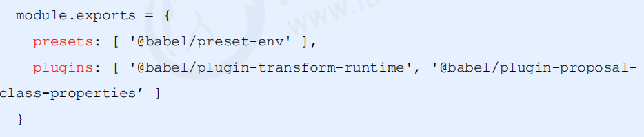

1.  在 webpack.config.js 的 module -\> rules 数组中，添加 loader 规则如下

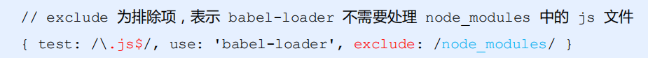

## ESLint

### 理解

-   ESLint 是一个代码规范检查工具

-   基本已替代以前的 JSHint

-   ESLint 提供以下支持

    1.  ES6

        1.  AngularJS

            1.  JSX

                4.  Style

### 自定义错误和提示

####  ESLint 提供以下几种校验

-   语法错误校验

-   不重要或丢失的标点符号，如分号

-   没法运行到的代码块（使用过 WebStorm 的童鞋应该了解）

-   未被使用的参数提醒

-   漏掉的结束符，如}

-   确保样式的统一规则，如 sass 或者 less

-   检查变量的命名

#### 规则的错误等级有三种

-   0：关闭规则检查

-   1：打开规则检查，并且作为一个警告（输出提示文本黄色）

-   2：打开规则检查，并且作为一个错误（输出提示文本红色）

### 相关配置文件 

-   .eslintrc.js : 规则相关配置文件, 可以在此修改规则

-   .eslintignore: 指令检查忽略的文件, 可以在此添加想忽略的文件

## Vue单文件组件

### 传统组件的问题和解决方案

-   问题

1.  全局定义的组件必须保证组件的名称不重复

2.  字符串模板缺乏语法高亮，在 HTML 有多行的时候，需要用到丑陋的 \\

3.  不支持 CSS 意味着当 HTML 和 JavaScript 组件化时，CSS 明显被遗漏

4.  没有构建步骤限制，只能使用 HTML 和 ES5 JavaScript,
    而不能使用预处理器（如：Babel）

-   解决方案

1.  针对传统组件的问题，Vue 提供了一个解决方案 —— 使用 Vue 单文件组件。

### Vue 单文件组件的基本用法

#### 单文件组件的组成结构

-   template 组件的模板区域

-   script 业务逻辑区域

-   style 样式区域

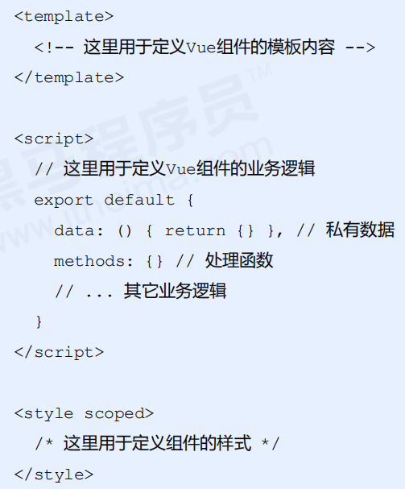

### webpack 中配置 vue 组件的加载器

1.  运行 npm i vue-loader vue-template-compiler -D 命令

2.  在 webpack.config.js 配置文件中，添加 vue-loader 的配置项如下：

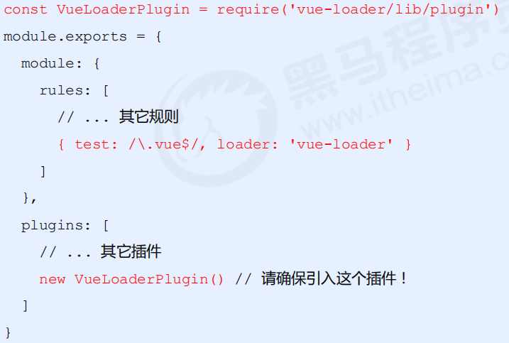

### 在 webpack 项目中使用 vue

1.  运行 npm i vue –S 安装 vue

2.  在 src -\> index.js 入口文件中，通过 import Vue from 'vue' 来导入 vue
    构造函数

3.  创建 vue 的实例对象，并指定要控制的 el 区域

4.  通过 render 函数渲染 App 根组件

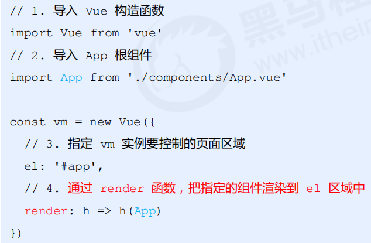

### webpack 打包发布

-   上线之前需要通过webpack将应用进行整体打包，可以通过 package.json
    文件配置打包命令：npm run build

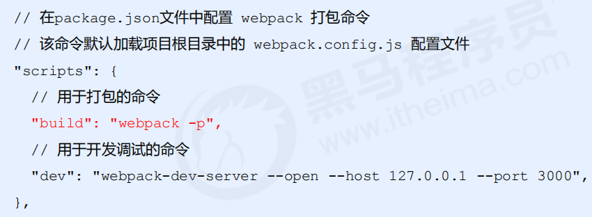

## Vue 脚手架的基本用法

-   Vue 脚手架用于快速生成 Vue
    项目基础架构，其官网地址为：https://cli.vuejs.org/zh/

-   使用步骤

1.  安装 3.x 版本的 Vue 脚手架：npm install -g \@vue/cli

2.  基于3.x版本的脚手架创建vue项目

3.  基于 交互式命令行 的方式，创建 新版 vue 项目: vue create my-project

4.  基于 图形化界面 的方式，创建 新版 vue 项目: vue ui

5.  基于 2.x 的旧模板，创建 旧版 vue 项目:

6.  npm install -g \@vue/cli-init

7.  vue init webpack my-project

###  Vue 脚手架生成的项目结构分析

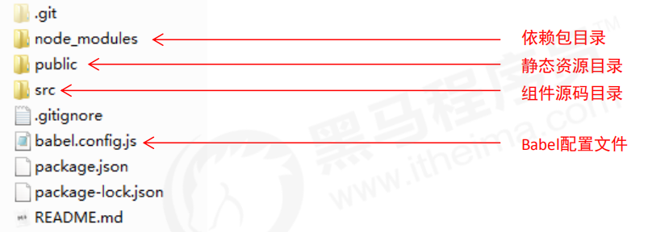

### Vue 脚手架的自定义配置

-   通过 package.json 配置项目(注意：不推荐使用这种配置方式。因为 package.json
    主要用来管理包的配置信息；为了方便维护，推荐将 vue
    脚手架相关的配置，单独定义到 vue.config.js 配置文件中)

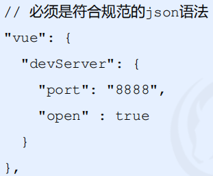

-   通过单独的配置文件配置项目.在项目的跟目录创建文件
    vue.config.js.在该文件中进行相关配置，从而覆盖默认配置;

## iconfont 字体图标

### iconfont 介绍

-   意义：使用字体用 HTML 代码以文本的形式直接在网页中画 icon 小图标

-   为什么使用 icon 字体图标: 使用图标字体可大大减少图标维护工作量

-   灵活性：轻松地改变图标的颜色或其他 CSS 效果

-   可扩展性：改变图标的大小，就像改变字体大小一样容易

-   矢量性：图标是矢量的，与像素无关。缩放图标不会影响清晰度

-   兼容性：字体图标支持所有现代浏览器（包括糟糕的 IE6）

-   本地使用：通过添加定制字体到你的本地系统，你可以在各种不同的设计和编辑应
    用程序中使用它们

### iconfont 使用

-   我们需要依赖网站制作

-   目前国内用的最多的是阿里巴巴矢量库（http://www.iconfont.cn/）

1.  注册账户

2.  把你想要的图标添加入库（购物车）

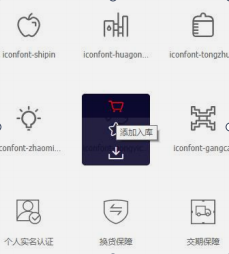

1.  点击购物车，将你想要的图标添加到项目中

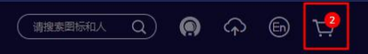

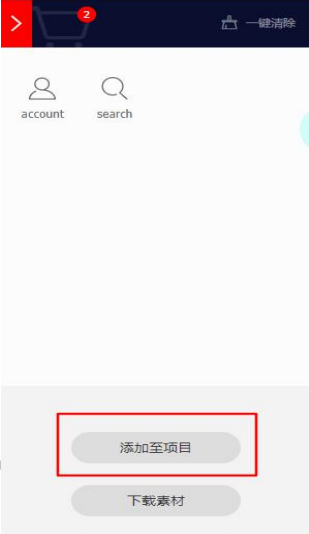

1.  下载到本地使用

    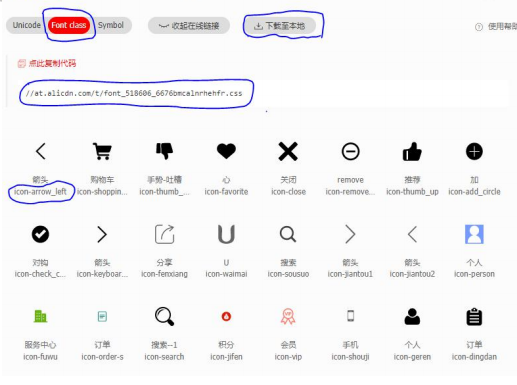

2.  三种使用方式

3.  unicode 引用

4.  symbol 引用

5.  font-class 引用

## LESS

### 当前主流的三种 css 预编译器

-   LESS

-   SASS

-   STYLUS

### 安装LESS

-   npm install less less-loader --save-dev

### 编写样式

-   \<style lang="less" rel="stylesheet/less"\>\</style\>

## Vue-Router

### 路由的基本概念与原理

-   路由是一个比较广义和抽象的概念,路由的本质就是对应关系

-   在开发中,路由分为

    1.  后端路由

        1.  概念:根据不同的用户URL请求,返回不同的内容

            1.  本质:URL请求地址与服务器资源之间的对应关系

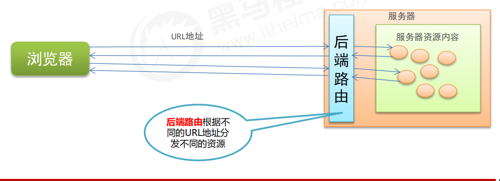

### 前端路由

#### SPA(Single Page Application)

-   后端渲染(存在性能问题)

-   Ajax前端渲染(前端渲染提高性能,但是不支持浏览器的前进后退操作)

-   SPA(Single Page
    Application)单页面应用程序:整个网站只有一个页面,内容的变化通过ajax局部更新实现,同时支持浏览器地址栏的前进后退操作

-   SPA实现原理之一:基于URL地址的hash(hash的变化会导致浏览器历史记录访问历史的变化,但是hash的变化不会触发新的URL请求)

-   在实现SPA的过程中,最核心的技术点就是前端路由

#### 前端路由基本概念及本质

-   概念:根据不同的用户事件,显示不同的页面关系

-   本质:用户事件与事件处理函数之间的对应关系

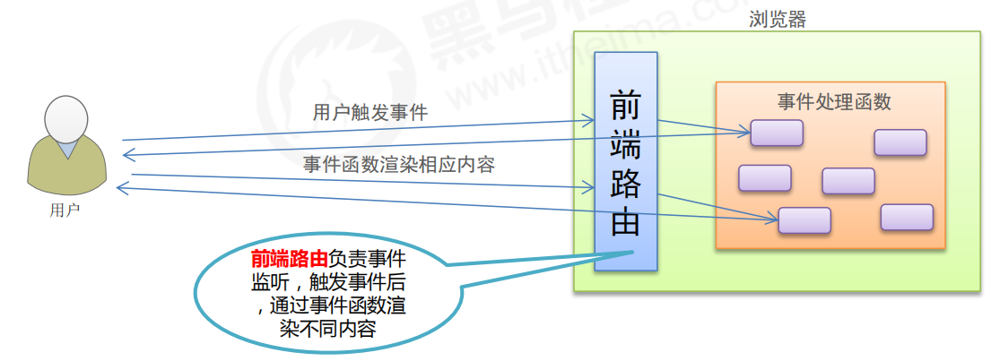

### Vue Router

-   Vue Router（官网：https://router.vuejs.org/zh/）是 Vue.js 官方的路由管理器。

-   它和 Vue.js 的核心深度集成，可以非常方便的用于SPA应用程序的开发。

#### Vue Router 包含的功能有

-   支持HTML5 历史模式或 hash 模式

-   支持嵌套路由

-   支持路由参数

-   支持编程式路由

-   支持命名路由

#### Vue-router的基本使用

-   引入相关的库文件

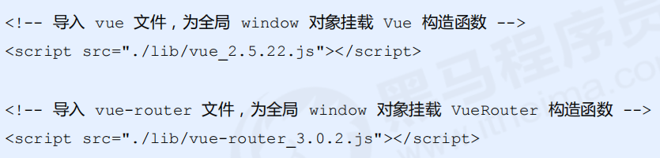

-   添加路由链接

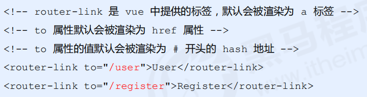

-   添加路由填充位

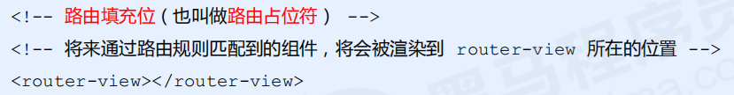

-   定义路由组件

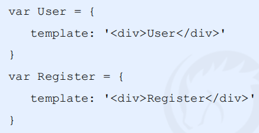

-   配置路由规则并创建路由实例

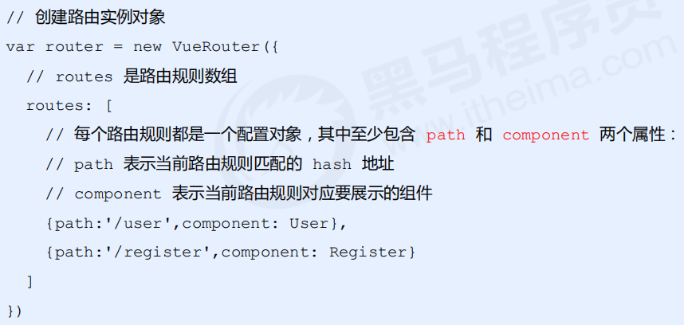

-   把路由挂载到vue跟实例中

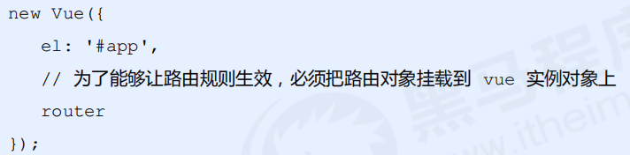

### Vue-Router路由重定向

-   路由重定向指的是:用户在访问地址A的时候,强制用户跳转到地址C,从而展示特定的组件页面;

-   通过路由规则的redirect属性,指定一个新的路由地址,可以很方便地设置路由的重定向

-   其中,path表示需要被重定向的原地址,redirect表示将要被重定向到的新地址

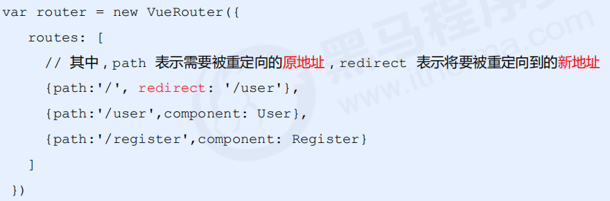

### Vue-Router嵌套路由用法

-   嵌套路由功能分析

1.  点击父级路由连接显示模板内容

2.  模板中又有子级路由链接

3.  点击子级路由链接显示子级模板内容

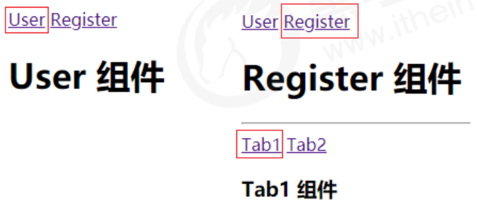

#### 父级路由组件模板

-   父级路由链接

-   父组件路由填充位

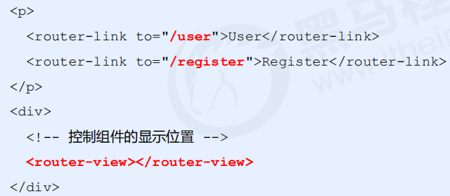

#### 子级路由模板

-   子级路由链接

-   子级路由填充位

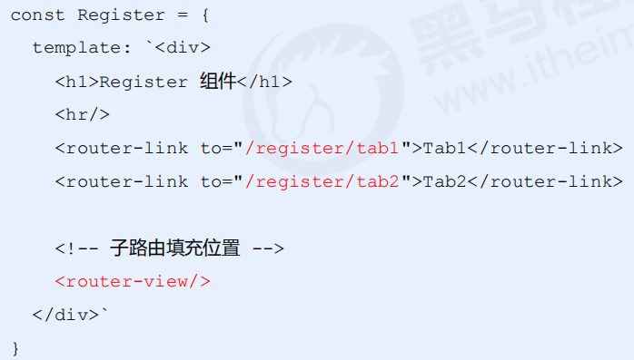

#### 嵌套路由配置

-   父级路由通过children属性配置子级路由

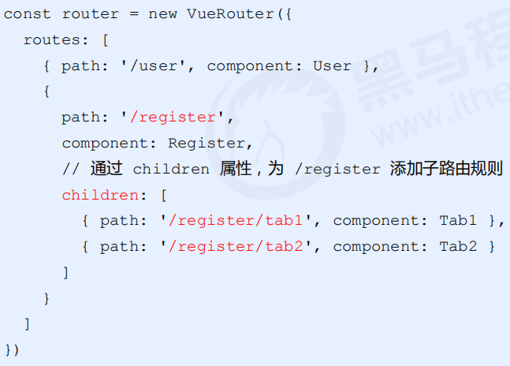

### Vue-Router动态路由匹配

-   动态路由匹配路由的基本用法

1.  应用场景:通过动态路由参数的模式进行路由匹配

2.  动态路径参数 以冒号开头

3.  路由组件通过\$route.params.参数 获取路由参数

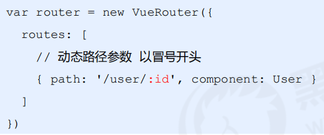

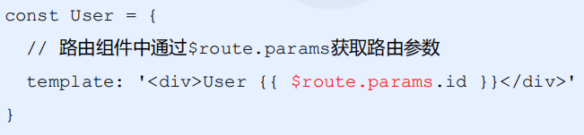

### 路由组件传递参数

#### Props的值为布尔类型

-   如果props被设置为true,route.params将会被设置为组件属性

-   使用props接收路由参数

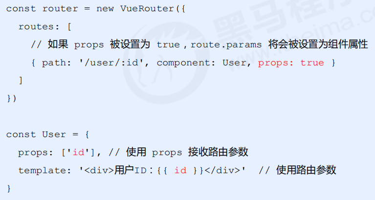

#### Props的值为对象类型

-   如果props是一个对象,它会被按原样设置为组件属性

-   使用props接收路由参数

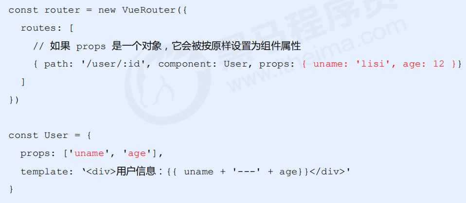

#### Props的值为函数类

-   如果props是一个函数,则这个函数接收route对象为自己形参

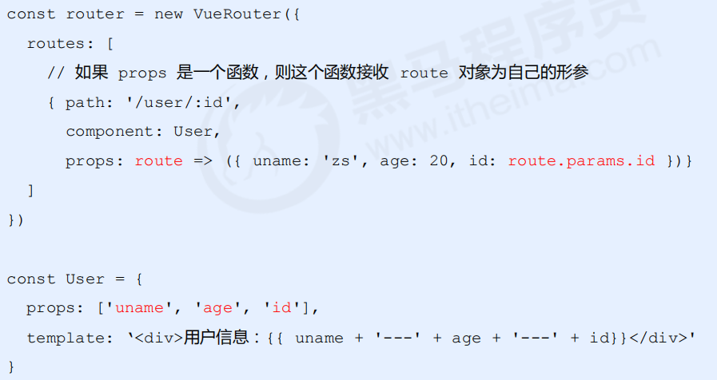

### Vue-Router命名路由

-   命名路由的配置规则

1.  为了更加方便的表示路由的路径,可以给路由规则起一个别名,即为’命名路由’

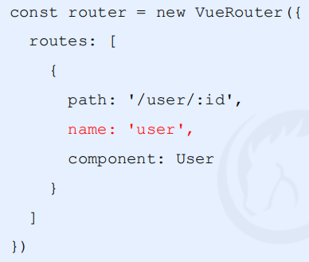

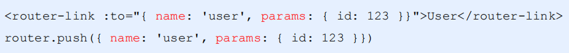

### Vue-Router编程式导航

-   页面导航的两种方式

1.  声明式导航:通过点击链接实现导航的方式,叫做声明式导航

2.  例如:普通网页中的\<a\>\</a\>链接或vue中\<route-link\>\</route-link\>

3.  编程式导航:通过调用JavaScript形式API实现导航的方式,叫做编程式导航

4.  例如:普通网页中的location.href

#### 编程式导航的基本用法

##### 常用编程式导航API如下

1.  this.\$router.push(‘hash地址’)

2.  this.\$router.go(n)

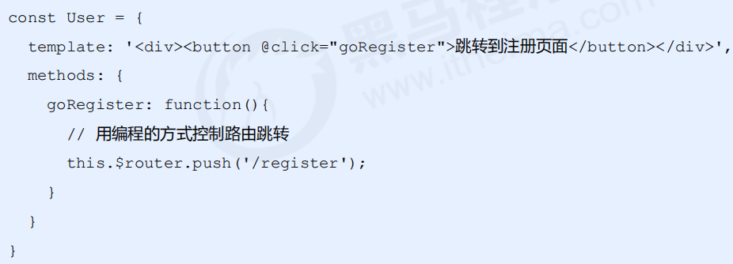

#### route.push()方法的参数规则

-   字符串(路径名称)

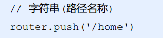

-   对象

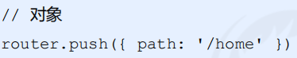

-   命名的路由(传递参数)

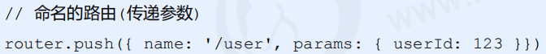

-   带参数查询,变成/register?uname=lisi

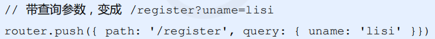

## 前后台交互ajax

### 下载依赖包

-   使用npm：npm install --save axios

-   使用 cdn: \<script
    src="https://unpkg.com/axios/dist/axios.min.js"\>\</script\>

### 请求方法

-   axios.request(config)

-   axios.get(url[, config])

-   axios.delete(url[, config])

-   axios.head(url[, config])

-   axios.options(url[, config])

-   axios.post(url[, data[, config]])

-   axios.put(url[, data[, config]])

-   axios.patch(url[, data[, config]])

### 案例

-   GET请求

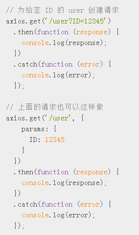

-   POST请求

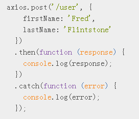

## Element-UI 的基本使用

-   Element-UI：一套为开发者、设计师和产品经理准备的基于 Vue 2.0
    的桌面端组件库。

-   官网地址为： http://element-cn.eleme.io/\#/zh-CN

### 基于命令行方式手动安装

1.  安装依赖包 npm i element-ui –S

2.  导入 Element-UI 相关资源

3.  配置vue组件

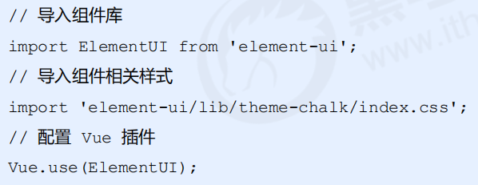

### 基于图形化界面自动安装

1.  运行 vue ui 命令，打开图形化界面

2.  通过 Vue 项目管理器，进入具体的项目配置面板

3.  点击 插件 -\> 添加插件，进入插件查询面板

4.  搜索 vue-cli-plugin-element 并安装

5.  配置插件，实现按需导入，从而减少打包后项目的体积

## Vuex

### 组件之间共享数据的方式

-   父向子传值: v-bind属性绑定

-   子向父传值: v-on事件绑定

-   兄弟组件之间共享数据:EventBus

-   \$on 接收数据的那个组件

-   \$emit 发送数据的那个组件

### Vuex是什么

-   Vuex是实现组件全局状态(数据)管理的一种机制,可以方便的实现组件之间的数据共享

-   使用Vuex统一管理状态的好处

1.  能够在vuex中集中管理共享的数据,易于开发和后期维护

2.  能够高效地实现组件之间的数据共享,提高开发效率

3.  存储在vuex中的数据都是响应式的,能够实时保持与页面的同步

### 什么样的数据适合存储到Vuex中

-   一般情况下,只有组件之间共享的数据,才有必要存储到vuex中

-   对于组件中的私有数据,依旧存储在组件自身的data中即可

### Vuex的基本使用

#### 安装vuex依赖包

-   npm install vuex --save

#### 导入vuex包

-   import Vuex from ‘vuex’

-   Vue.use(Vuex)

#### 创建store对象

-   const store=new Vuex.Store({})

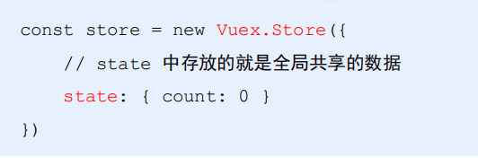

#### 将store对象挂载到vue实例中

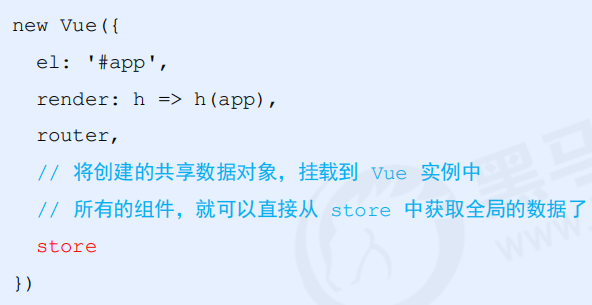

### Vuex核心概念

-   State

-   Mutation

-   Action

-   Getter

### State

-   State提供唯一的公共数据源,所有共享的数据都要统一放到Store的State中进行存储

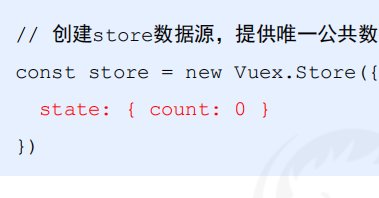

#### 组件中访问State中的数据第一种方式

-   this.\$store.state.全局数据名称

#### 组件中访问State中数据的第二种方式

-   从vuex中按需导入mapState函数

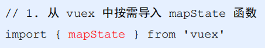

-   通过刚才导入的mapState函数,将当前组件需要的全局数据,映射为当前组件的computed计算属性

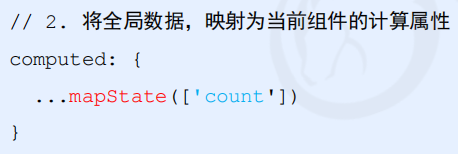

### Mutation

-   Mutation用于变更Store中的数据

-   只能通过Mutation变更Store数据,不可以直接操作Store中的数据

-   通过这种方式虽然操作起来稍微繁琐一些,但是可以集中监控所有数据的变化

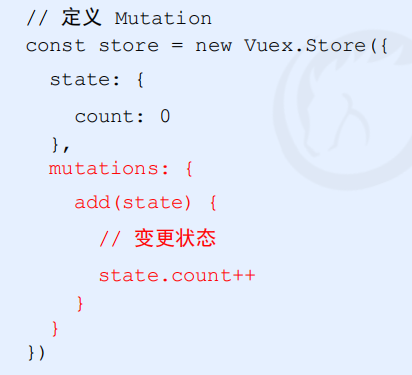

#### 组件中触发Mutation的第一种方式

-   this.\$store.commit(‘commit函数’, ’参数’)

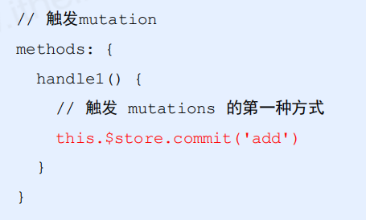

-   可以在触发mutation时传递参数

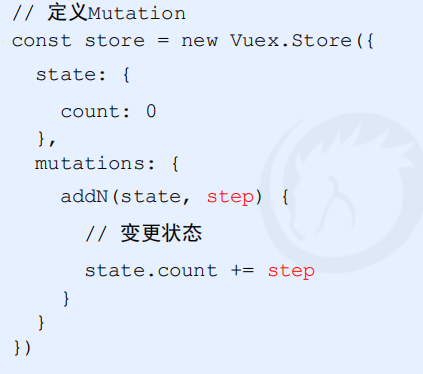

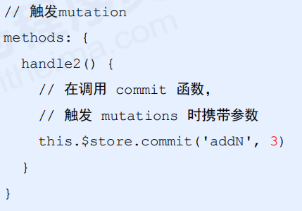

#### 组件中触发Mutation的第二种方式

-   从vuex中按需导入mapMutation函数

-   通过刚才导入的mapMutation函数,将需要Mutation函数,映射为当前组件的methods方法

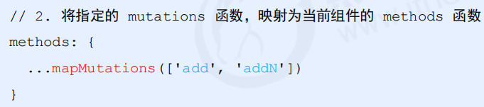

### Action

-   Action用于处理异步任务

-   如果通过异步操作变更数据,必须通过Action,而不能使用Mutation

-   在Action中还是通过触发mutation的方式间接变更

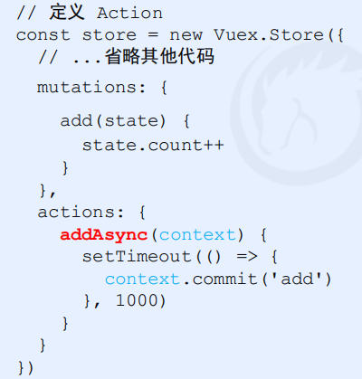

#### 触发Action的第一种方式

-   this.\$store.dispatch(‘action函数’)

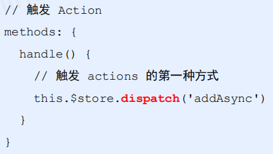

-   触发action异步任务时携带参数

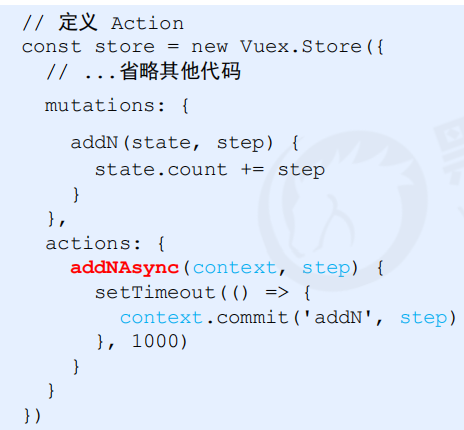

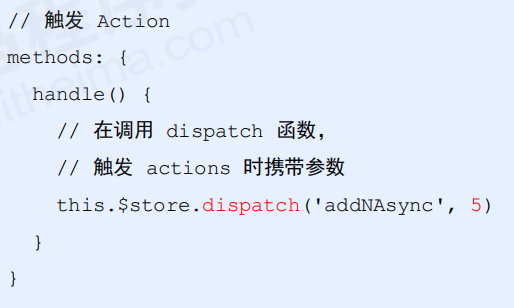

#### 触发action的第二种方式

-   从vuex中按需导入mapActions函数

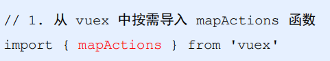

-   通过刚才导入的mapActions函数,将需要的actions函数,映射为当前组件的methods方法

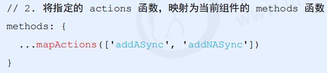

### Getter

-   Getter用于对store中的数据进行加工处理形成新的数据

-   Getter可以对Store中已有的数据处理之后形成的新数据,类似Vue的计算属性

-   Store中数据发生变化,Getter的数据也会跟着变化

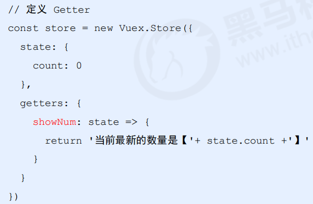

#### 使用Getter的第一种方式

-   this.\$store.getters.名称

#### 使用Getter的第二种方式

-   从vuex中按需导入mapGetters函数

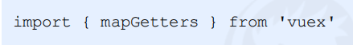

-   通过刚才导入的mapGetters函数,将需要Getter函数,映射为当前组件的compued方法

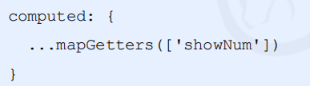

## 代码测试与打包发布项目

### 编码测试

-   npm run dev

-   访问: <http://localhost:8080>

-   编码,自动编译打包(HMR),查看效果

### 打包发布

-   npm run build

-   npm install -g serve

-   Serve dist

-   访问: <http://localhost:5000>

# Vue全家桶-项目优化上线

## 项目优化

1. 生成打包报告

2. 第三方库启用 CDN

3. Element-UI 组件 \\ VANT组件 按需加载

4. 路由懒加载

5. 首页内容定制

### 生成打包报告

-   打包时，为了直观地发现项目中存在的问题，可以在打包时生成报告。生成报告的方式有两种：

1.  通过命令行参数的形式生成报告

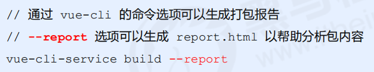

1.  通过可视化的UI面板直接查看报告（推荐）

在可视化的UI面板中，通过控制台和分析面板，可以方便地看到项目中所存在的问题。

###  通过 vue.config.js 修改 webpack 的默认配置

-   通过 vue-cli 3.0 工具生成的项目，默认隐藏了所有 webpack
    的配置项，目的是为了屏蔽项目的配置过程，让程
    序员把工作的重心，放到具体功能和业务逻辑的实现上。

-   如果程序员有修改 webpack 默认配置的需求，可以在项目根目录中，按需创建
    vue.config.js 这个配置文件，从
    而对项目的打包发布过程做自定义的配置（具体配置参考
    https://cli.vuejs.org/zh/config/\#vue-config-js）

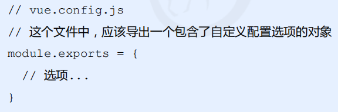

### 为开发模式与发布模式指定不同的打包入口 

默认情况下，Vue项目的开发模式与发布模式，共用同一个打包的入口文件（即
src/main.js）。为了将项目的开发过程与发布过程分离，我们可以为两种模式，各自指定打包的入口文件，即：

① 开发模式的入口文件为 src/main-dev.js

② 发布模式的入口文件为 src/main-prod.js

### configureWebpack 和 chainWebpack

在 vue.config.js 导出的配置对象中，新增 configureWebpack 或 chainWebpack
节点，来自定义 webpack 的打包配置。

在这里， configureWebpack 和 chainWebpack 的作用相同，唯一的区别就是它们修改
webpack 配置的方式不同：

① chainWebpack 通过链式编程的形式，来修改默认的 webpack 配置

② configureWebpack 通过操作对象的形式，来修改默认的 webpack 配置

两者具体的使用差异，可参考如下网址：

<https://cli.vuejs.org/zh/guide/webpack.html#webpack-%E7%9B%B8%E5%85%B3>

### 通过 chainWebpack 自定义打包入口

代码示例如下：

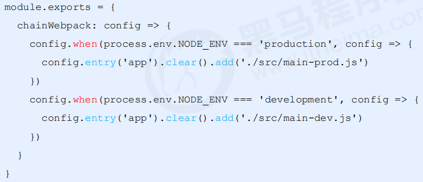

### 通过 externals 加载外部 CDN 资源

-   默认情况下，通过 import
    语法导入的第三方依赖包，最终会被打包合并到同一个文件中，从而导致打包成功后，单文件体积过大的问题。

-   为了解决上述问题，可以通过 webpack 的 externals 节点，来配置并加载外部的 CDN
    资源。凡是声明在 externals 中的第三方依赖包，都不会被打包。

具体配置代码如下：

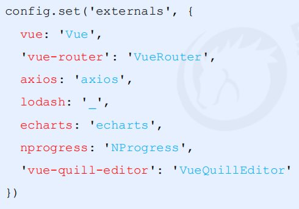

-   同时，需要在 public/index.html 文件的头部，添加如下的 CDN 资源引用：

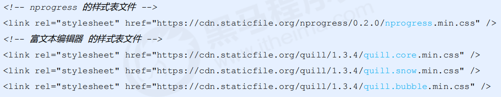

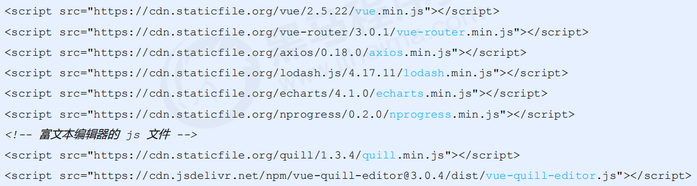

### 通过 CDN 优化 ElementUI 的打包

虽然在开发阶段，我们启用了 element-ui
组件的按需加载，尽可能的减少了打包的体积，但是那些被按需加载的组件，还是占用了较大的文件体积。此时，我们可以将
element-ui 中的组件，也通过 CDN
的形式来加载，这样能够进一步减小打包后的文件体积。

具体操作流程如下：

① 在 main-prod.js 中，注释掉 element-ui 按需加载的代码

② 在 index.html 的头部区域中，通过 CDN 加载 element-ui 的 js 和 css 样式

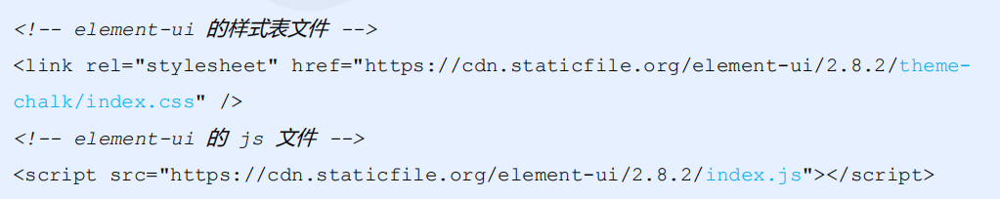

### 首页内容定制

不同的打包环境下，首页内容可能会有所不同。我们可以通过插件的方式进行定制，插件配置如下：

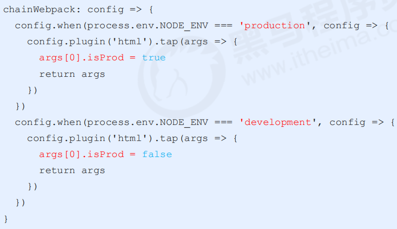

-   在 public/index.html 首页中，可以根据 isProd 的值，来决定如何渲染页面结构：

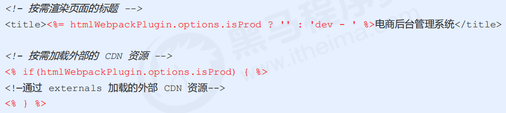

### 路由懒加载

当打包构建项目时，JavaScript
包会变得非常大，影响页面加载。如果我们能把不同路由对应的组件分割成不同的代码块，然后当路由被访问的时候才加载对应组件，这样就更加高效了。

具体需要 3 步：

① 安装 \@babel/plugin-syntax-dynamic-import 包。

② 在 babel.config.js 配置文件中声明该插件。

③ 将路由改为按需加载的形式，示例代码如下：

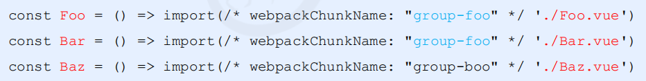

-   关于路由懒加载的详细文档，可参考如下链接：

-   <https://router.vuejs.org/zh/guide/advanced/lazy-loading.html>

## 项目上线

### 项目上线相关配置

1. 通过 node 创建 web 服务器。

2. 开启 gzip 配置。

3. 配置 https 服务。

4. 使用 pm2 管理应用

### 通过 node 创建 web 服务器

创建 node 项目，并安装 express，通过 express 快速创建 web 服务器，将 vue
打包生成的 dist 文件夹，托管为静态资源即可，关键代码如下：

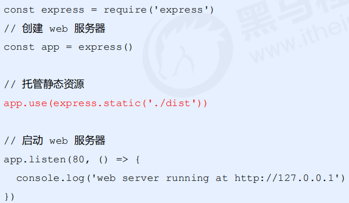

### 开启 gzip 配置

-   使用 gzip 可以减小文件体积，使传输速度更快。

-   可以通过服务器端使用 Express 做 gzip 压缩。其配置如下：

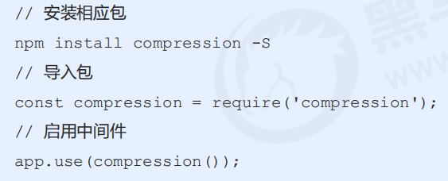

### 配置 HTTPS 服务

#### 为什么要启用 HTTPS 服务？ 

-   传统的 HTTP 协议传输的数据都是明文，不安全

-   采用 HTTPS
    协议对传输的数据进行了加密处理，可以防止数据被中间人窃取，使用更安全

#### 申请 SSL 证书（https://freessl.org）

① 进入 https://freessl.cn/ 官网，输入要申请的域名并选择品牌。

② 输入自己的邮箱并选择相关选项。

③ 验证 DNS（在域名管理后台添加 TXT 记录）。

④ 验证通过之后，下载 SSL 证书（ full_chain.pem 公钥；private.key 私钥）

### 配置 HTTPS 服务

**在后台项目中导入证书**

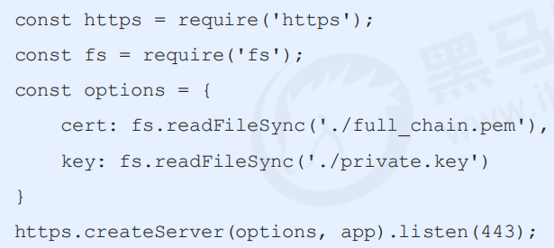

### 使用 pm2 管理应用

1.  在服务器中安装 pm2：npm i pm2 -g

2.  启动项目：pm2 start 脚本 --name 自定义名称

3.  查看运行项目：pm2 ls

4.  重启项目：pm2 restart 自定义名称

5.  停止项目：pm2 stop 自定义名称

6.  删除项目：pm2 delete 自定义名称

### 使用GITHUB托管代码

1.  创建并登陆github.com

2.  新建一个仓库

    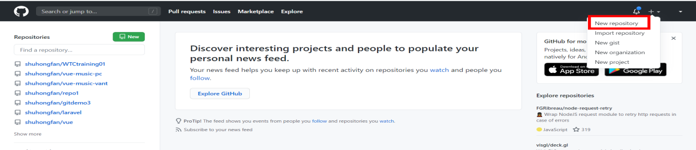

3.  填写仓库名称并创建仓库

    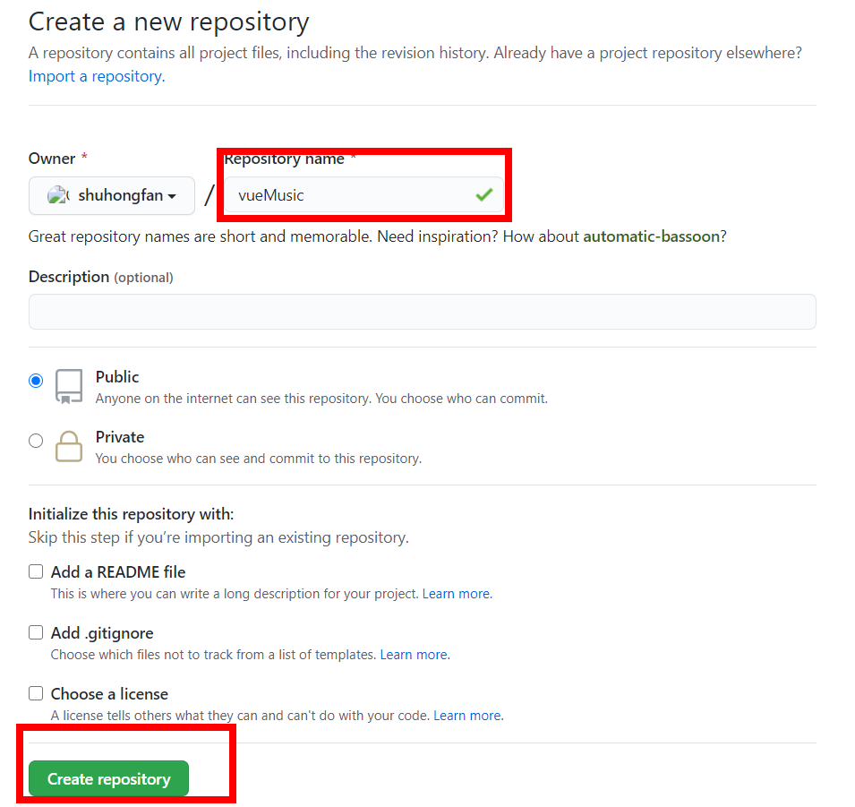

4.  找到项目仓库地址

    

5.  推送代码 ---- 在Vue项目根目录依次运行下列代码

6.  git add .

7.  git commit -m "first commit"

8.  git branch -M main

9.  git remote add origin 你自己仓库的地址

10. git push -u origin main

### 使用CODING.NET托管代码并且产生静态网站

1.  注册并登陆coding.net

2.  创建项目(DevOps项目)

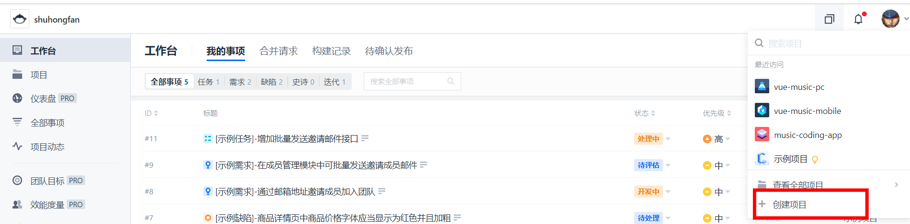

1.  填写项目基本信息

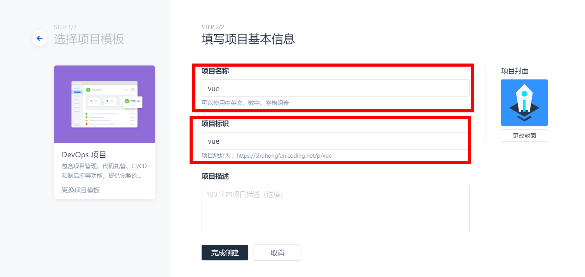

1.  创建代码仓库

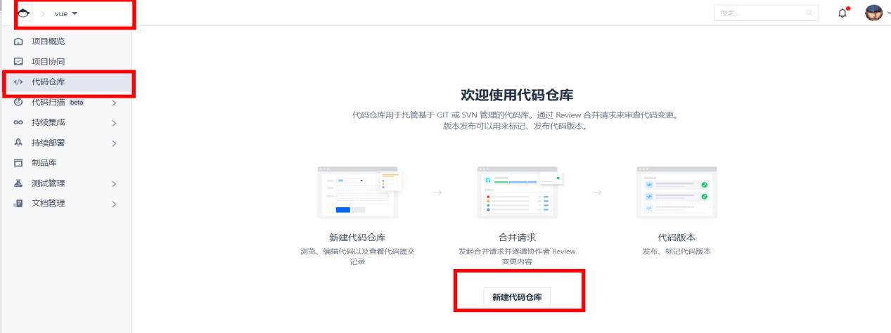

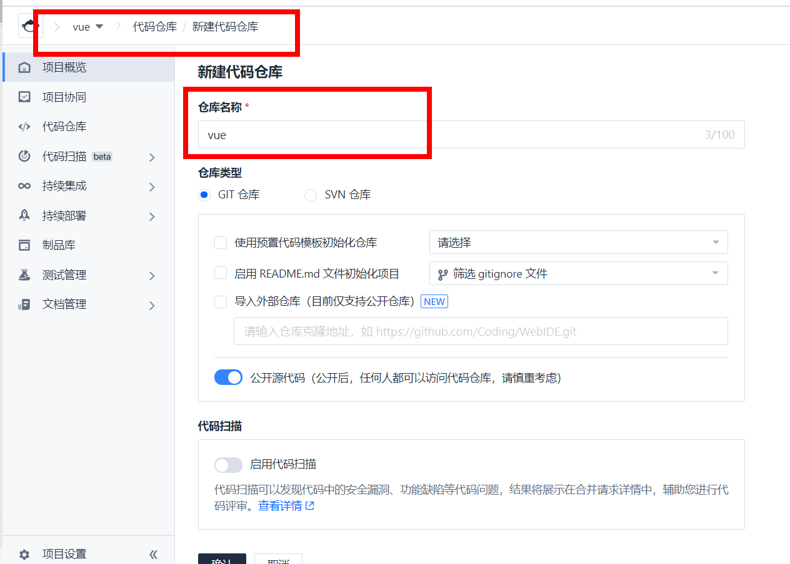

1.  查看仓库地址

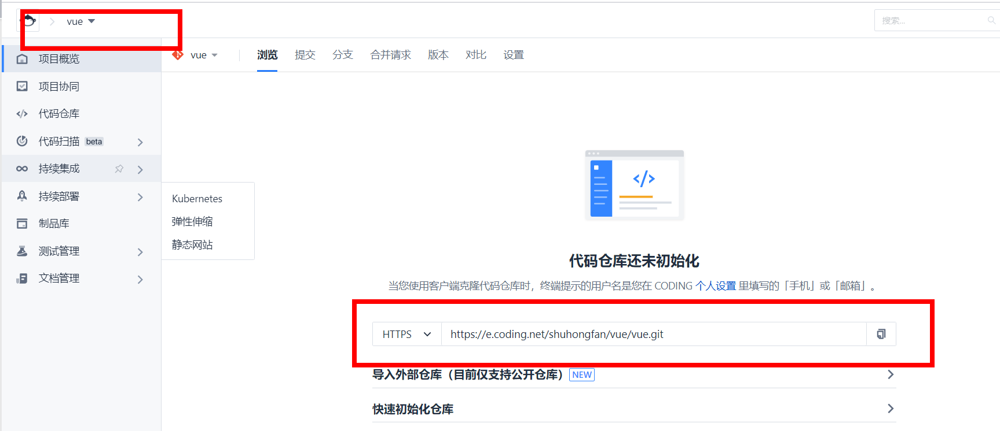

1.  推送代码 ---- 在Vue项目根目录依次运行下列代码

2.  git add .

3.  git commit -m "first commit"

4.  git branch -M main

5.  git remote add origin 你自己仓库的地址

6.  git push -u origin main

7.  创建静态网站

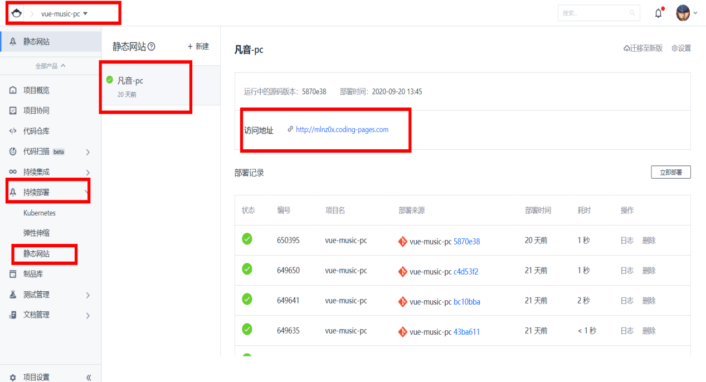

1.  在浏览器中访问

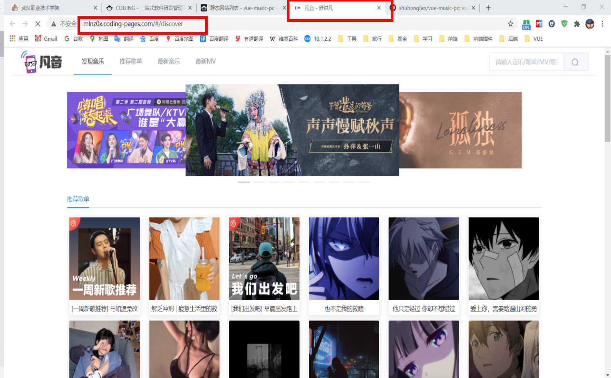

# 总结

通过这次实训,我对大学3年来所学习的计算机网络技术专业（网站前端开发工程师方向）的总结,通过掌握网站前端的开发技术，掌握网站前端开发流程，综合锻炼系统运用所学知识的能力。

通过制作WEB音乐播发器APP，综合运用以前的课程知识《图像处理技术》、《网页视觉设计》、《网页设计与网站建设》、《CSS+DIV网站标准化重构》、《Javascript网站动态特效设计》、《Jquery框架》、《PHP程序设计》、《Bootstrap
UI框架》、《Vue.js》、《node.js》等课程,使用图像处理绘制网站图纸，并进行素材的切片，然后进行布局，用VUE设置特效，从面构建出前端页面，最后适配PC端、手机端、移动端。

在这次毕业设计中还锻炼我其他方面的潜力,提高了我的综合素质.首先,它锻炼了我做项目的潜力,提高了独立思考问题,自我动手操作的能力,在做项目的过程中,复习了以前学习过的知识,并掌握了一些应用知识等.其次这次实训将会有利于我更好适应以后的工作,我会把握和珍惜实训机会,在未来的工作中我会把学校学到的理论知识和实践理论不断地应用到实际工作中,为实现理想而努力.
